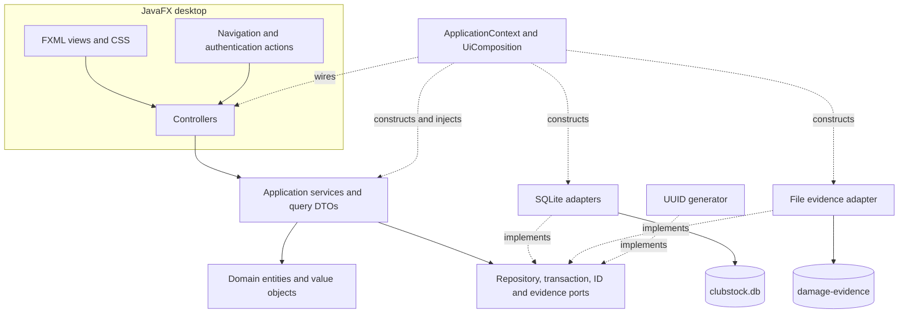
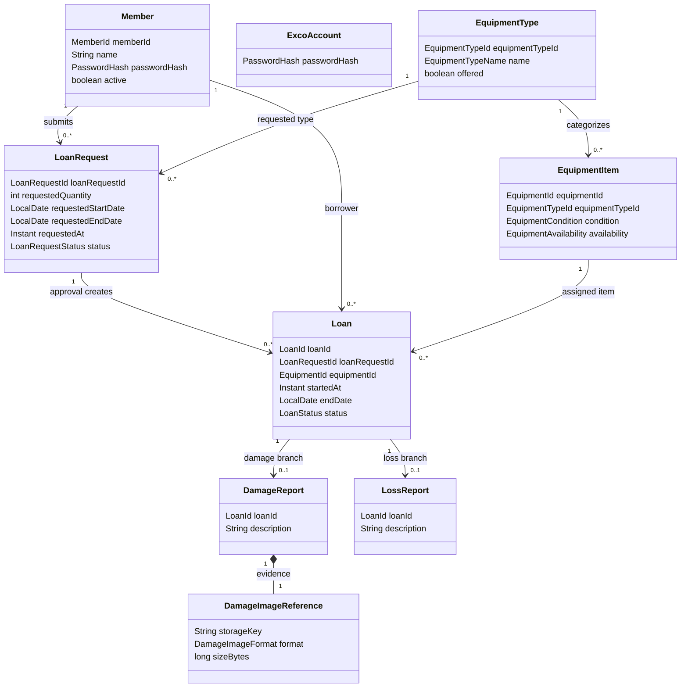
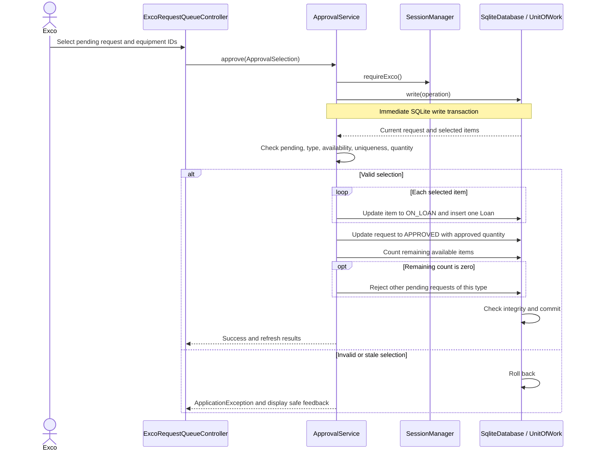
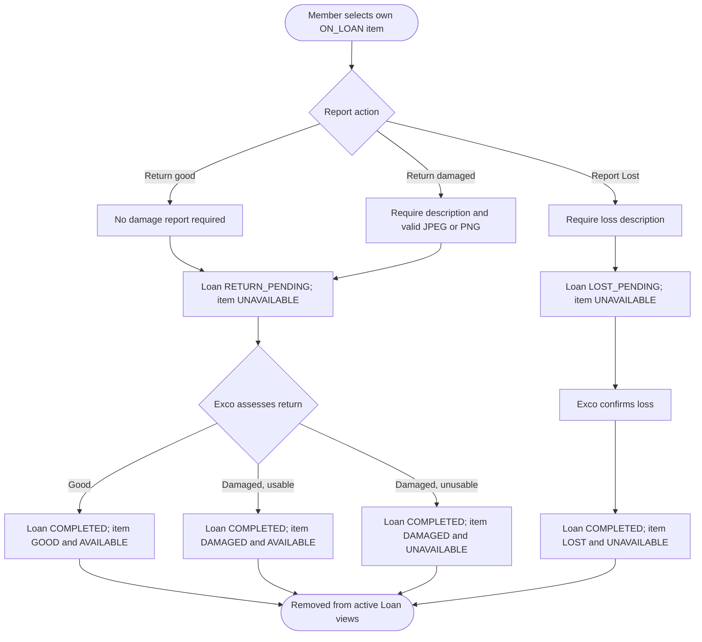

# ClubStock Developer Guide

This guide describes the current desktop implementation and the steps needed to prepare a
v1 deployment. The checked-in build version is **0.4.0**; this document does not declare v1
released or certify that release checks have passed. Requirement status below means that
implementation and relevant tests exist in the repository, not that those tests were run
as part of this documentation update.

ClubStock manages a club's equipment on one machine. Members request equipment types and
report individual returns or losses. Exco administers accounts and inventory, allocates
physical items, and verifies reports. Both roles use the same local database.

## Contents

1. [Setup guide](#1-setup-guide)
2. [Project design and architecture](#2-project-design-and-architecture)
3. [Requirements and use cases](#3-requirements-and-use-cases)
4. [Software engineering process](#4-software-engineering-process)
5. [Glossary](#5-glossary)
6. [Instructions for manual testing](#6-instructions-for-manual-testing)
7. [Automated verification commands](#7-automated-verification-commands)
8. [Acknowledgements](#8-acknowledgements)

## 1. Setup guide

### 1.1 Required software and dependencies

Install Git to obtain the source, and a JDK for building and running the application.
An IDE with Gradle support is optional. No database server, separately installed Gradle,
or external application service is required. A graphical desktop is required for normal
operation and JavaFX smoke verification.

The versions below are the repository's pinned configuration, not a claim about the latest
upstream releases. See [build.gradle](../build.gradle) and the
[Gradle wrapper properties](../gradle/wrapper/gradle-wrapper.properties).

| Software or dependency | Version | Purpose |
| --- | --- | --- |
| Java JDK | 25 | Compilation, Gradle toolchain, and application runtime |
| JavaFX base, controls, FXML, graphics | 25.0.3 in Gradle | Desktop interface and native rendering |
| Gradle wrapper | 9.1.0 | Reproducible build entry point |
| Shadow Gradle plugin | 9.2.2 | Package application and dependencies into a fat JAR |
| Xerial SQLite JDBC | 3.53.4.0 | Embedded local database access |
| ICU4J | 78.3 | Unicode case folding for equipment-type name uniqueness |
| JUnit Jupiter / BOM | 5.14.3 | Automated tests; not an application runtime dependency |

Use JDK 25 FX Zulu on Apple Silicon Macs, as required by the project guidance; on other
platforms use JDK 25 for the matching architecture. The Gradle build resolves its own pinned
JavaFX artifacts. Set `JAVA_HOME` to the JDK directory and ensure its `bin` directory is on
`PATH`. Confirm the selected tools from the repository root:

```sh
java -version
./gradlew --version
```

On Windows PowerShell, use `.\gradlew.bat` in place of `./gradlew`. Initial dependency
resolution requires network access. Subsequent application use is local.

### 1.2 Build, run, and package

From the cloned repository root:

```sh
./gradlew build
./gradlew run
./gradlew shadowJar
```

`build` compiles and runs the default tests; it does not run the separate display smoke
suite. `run` starts the development application. `shadowJar` produces the distributable
JAR under `build/libs/`. Packaging alone does not prove that the tests passed.

Dependencies follow the [SE-EDU JavaFX Part 1 guide](https://se-education.org/guides/tutorials/javaFxPart1.html),
using the project's JavaFX version. Native libraries target Windows x64, Linux x64,
and one macOS architecture per artifact, because macOS native filenames overlap.
The macOS classifier defaults to `mac-aarch64` on ARM hosts and `mac` otherwise.
Use `./gradlew shadowJar -PmacJavaFxPlatform=mac` for Intel macOS or
`./gradlew shadowJar -PmacJavaFxPlatform=mac-aarch64` for Apple Silicon.
The output classifier follows the selected macOS architecture:

| Output (version from `build.gradle`) | Target platforms |
| --- | --- |
| `ClubStock-0.4.0-desktop.jar` | Windows x64, Linux x64, Intel Mac |
| `ClubStock-0.4.0-apple-silicon.jar` | Apple Silicon Mac; also contains Windows x64 and Linux x64 libraries |

Run both commands above to produce both variants. Their filenames are distinct, so
they can coexist; do not run `clean` between them because it deletes both outputs.
Other architectures require matching native libraries.

The JARs bundle application dependencies, including JavaFX, but do not bundle Java.
Install Java 25 for the target architecture, then run, for example:

```sh
java -jar build/libs/ClubStock-0.4.0-desktop.jar
```

On Apple Silicon, use the `apple-silicon` JAR and an ARM64 Java 25 installation.

### 1.3 First run and local storage

On an empty data directory, startup creates the schema and the singleton Exco account with
no password. Choose Exco and set a password before normal login. There is no default Exco
password. Exco then creates Member accounts, equipment types, and physical items. Offer a
type to expose it in the Member catalogue; release its items to make them allocatable.
New types are unoffered and new items are `GOOD` / `UNAVAILABLE`.

Passwords require at least eight Unicode code points and a non-whitespace character.
Passwords are not trimmed and are stored as salted PBKDF2-HMAC-SHA256 hashes. Member IDs
are trimmed, immutable, and case-sensitive. Exco password change/recovery is deferred;
Member password replacement is available through Exco administration.

The default data directory is `${user.home}/.clubstock` (normally `~/.clubstock` on macOS
and Linux). `user.home` is the Java user's home directory, including on Windows.

```text
.clubstock/
  clubstock.db                 Shared accounts, inventory, requests, Loans, and reports
  damage-evidence/             Managed copies of JPEG/PNG damage images
    .staging/                 Temporary image staging
    .image-operations.lock    Coordination of image operations and reconciliation
```

Override the directory by placing the JVM property **before** `-jar`:

```sh
java -Dclubstock.dataDir="/absolute/path/clubstock-v1-data" -jar build/libs/ClubStock-0.4.0-desktop.jar
```

On Apple Silicon, substitute `ClubStock-0.4.0-apple-silicon.jar`. On Windows, use an
absolute Windows path, for example `-Dclubstock.dataDir="C:\ClubStock\data"`.
A relative override is resolved against the working directory. Use an absolute path for
repeatable deployment. Do not assume a property passed to the Gradle JVM reaches `run`;
use the packaged command above when selecting a custom data directory.

Sessions exist only in memory: logout clears the principal and restarting requires login.
UTC instants are stored for timestamps; the system timezone captured at startup determines
local date display and overdue checks. Requests do not reserve future stock.

### 1.4 Backup, upgrade, and recovery

1. Close every ClubStock process using the data directory.
2. Copy the **whole directory**, including the database and damage evidence, to a dated
   backup outside the live directory. Keep the associated JAR/version with the backup.
3. Install the new matching JAR and Java runtime, then launch with the same data directory.
   Startup applies supported schema migrations and validates persisted state.
4. Check login, inventory counts, pending work, and a retained damage image before accepting
   the upgrade. Record the checks against the release commit.

To restore, close the application and restore the complete backup into a separate directory,
then run its matching application version using `clubstock.dataDir`. Do not merge individual
rows or image directories. Downgrading a newer database is not a supported migration path.
No automatic backup or account-recovery UI is implemented.

Startup rejects corrupt or unsupported database state and unavailable storage; it does not
replace the database with an empty one. Preserve a copy before investigating. Image
reconciliation removes abandoned staging files and unreferenced generated images after
reading committed report references. Keep the database and evidence together when copying
or restoring, and do not place unrelated files in managed storage.

### 1.5 Deployment boundaries and troubleshooting

| Symptom | Check or action |
| --- | --- |
| Java version or class-version error | Confirm `java -version`, `JAVA_HOME`, and IDE Gradle JVM select Java 25 |
| JavaFX native-library failure | Match the JDK CPU architecture and macOS JAR variant; use a graphical session |
| Linux cannot open a display | Run on a desktop; use Xvfb for automated smoke checks as described in section 7 |
| Startup storage failure | Check write access, free space, directory override, and competing processes; preserve existing data |
| Empty catalogue | Offer a type; zero available stock alone does not hide an offered type |
| Added equipment is not allocatable | Explicitly release it; new items start unavailable |
| A workflow appears stale | Refresh or reopen the view; services recheck current state before writes |
| Damaged return reports an uncertain save | Refresh the Loan before retrying; evidence may already be committed |

Deploy as a local desktop application using a local writable directory. There is no hosted
API, multi-machine synchronization, installer, or bundled Java runtime. Role permissions
operate inside the application; users who can directly modify its files are outside that
boundary. Physical Intel Mac accelerated rendering remains a separate validation item
from the CI software-rendering check described in section 4.

## 2. Project design and architecture

### 2.1 Architectural style and component diagram

ClubStock is a layered desktop application with ports and adapters. FXML and controllers
handle interaction, application services coordinate use cases, domain objects enforce
entity lifecycle rules, and infrastructure implements persistence and image-storage ports.
The composition root wires concrete adapters into services once per process.



Solid arrows show use; dotted arrows show implementation or construction. Domain code does
not depend on JavaFX or JDBC. Services depend on ports rather than SQL implementations;
controllers do not access the database directly. `Clock` and `ZoneId` are injected Java
platform types, not custom repository ports.

### 2.2 Packages and responsibilities

All package names below are relative to `clubstock` in
[`src/main/java/clubstock`](../src/main/java/clubstock).

| Package / location | Responsibility and principal classes |
| --- | --- |
| Root package | `Launcher` is the non-JavaFX main class; `ClubStockApplication` starts the desktop; `ApplicationContext` constructs the backend; installation verifier classes handle `--verify-install` |
| `ui` | `UiComposition` injects controllers and navigation; `DialogStyling` shares dialog presentation |
| `ui.controller` | Role login/home screens, Member administration, inventory, requests, Loans, and verification controllers |
| `ui.navigation` | `Route`, `NavigationPolicy`, `JavaFxNavigator`, `FxmlViewLoader`, `ControllerFactory`, and safe error presentation |
| `ui.auth` | Authentication gateway adapter, role selection, login/logout actions and UI principal types |
| `application.auth` | Authentication, PBKDF2 hashing, session identity, and role guards |
| `application.member` | `MemberAccountService`: creation, rename, password replacement, protected deactivation |
| `application.inventory` / `catalog` | Exco inventory lifecycle and shared availability policy; Member catalogue DTOs omit item IDs |
| `application.request` | Member submission/cancellation, Exco queue/rejection, atomic approval/allocation |
| `application.loan` | Shared active-Loan queries and overdue display; Member return/loss submission |
| `application.verification` | Exco report queries, managed evidence reading, authoritative return/loss resolution |
| `application.port` | Transaction manager/unit of work, repository contracts, ID generation, evidence read/write contracts |
| `application` | Stable application error codes/exceptions and transaction outcome classification |
| `domain.account`, `equipment`, `request`, `loan`, `report` | Entities, typed IDs, validation, statuses and lifecycle transitions |
| `infrastructure.sqlite` | JDBC connections, schema migration, repository implementations inside `SqliteUnitOfWork`, integrity checking, commit/rollback |
| `infrastructure.file` | `FileDamageEvidenceStore`: content validation, staging, finalization, locking and reconciliation |
| `infrastructure.id` | `UuidIdGenerator` for application-generated identities |
| `src/main/resources/clubstock/ui` | Routed FXML files in `view/`, and shared `clubstock.css` |
| `src/main/resources/clubstock/infrastructure/sqlite/migration` | Versioned SQL; initial schema is `V001__initial_schema.sql` |
| `src/test/java/clubstock` | Domain, service, persistence, integration, UI resource, display and packaging tests; isolated fixtures |

Startup follows `Launcher → ClubStockApplication → ApplicationContext → UiComposition →
role selection`. Database migration, integrity checks and evidence reconciliation complete
before routes become usable. A fatal startup error prevents operation with a partial backend.

### 2.3 Core class diagram

This diagram shows selected fields and persisted associations, not every method. Links are
usually stored as typed IDs rather than in-memory object references.



One item can have multiple completed Loans, but at most one unresolved Loan. A Loan takes
one return/loss branch; damage and loss reports are mutually exclusive. The singleton
Exco account is independent of Member accounts. Completed records remain stored, although
the default active-Loan views exclude them.

### 2.4 Approval sequence and transaction boundary

[`ApprovalService`](../src/main/java/clubstock/application/request/ApprovalService.java)
rechecks the selection inside one write transaction. A list previously displayed in the UI
is not sufficient authority to allocate an item.



The approved quantity is `1..requestedQuantity`. Each Loan starts immediately using the
injected clock and copies the requested end date. Partial approval closes the request;
the remaining quantity does not remain pending. Stock exhaustion rejects only requests
already pending for the same type in that transaction. Later zero-stock requests are valid.

### 2.5 Return and loss activity diagram



Member reports do not change authoritative condition. Only Exco verification does. Pending
items cannot be allocated or removed, and a second return/loss submission is rejected.
Overdue is a derived indicator for `ON_LOAN` after its end date, not a lifecycle status.

### 2.6 Persistence, evidence, and failure handling

`SqliteDatabase` implements `TransactionManager`. Each operation receives repositories
scoped to a `SqliteUnitOfWork`. Connections enable foreign keys and a five-second busy
timeout; reads use deferred transactions and query-only mode, writes use immediate
transactions. Integrity is checked before commit. Repository adapters do not independently
commit. `SchemaMigrator` tracks schema version with `PRAGMA user_version`.

Member removal deactivates the account and equipment removal retires the item, preserving
identities and references. A pending request or unresolved Loan blocks Member removal.
An unresolved Loan blocks item removal. Referenced types can be unoffered; hard deletion
requires no referencing item, request, or Loan. Equipment-type names use Unicode case
folding for uniqueness, while user-supplied Member and equipment IDs are case-sensitive.

Damage images are copied into managed storage, so later deletion of the source image does
not remove the submitted evidence. Accepted content is JPEG/PNG, 1 byte through 5 MiB,
with dimensions at most 10,000 per axis and at most 16 million pixels. Actual image content
is validated, not just its filename extension.

File operations and SQLite cannot share one atomic commit. Damaged return submission
therefore locks evidence operations, validates and stages the image, finalizes the managed
copy, then rechecks and commits the report and Loan/item transitions. Confirmed rollback
permits compensation. An uncertain database outcome preserves potentially referenced
evidence and tells the caller to refresh before retrying. Startup reconciliation coordinates
with the same lock and removes abandoned generated files using committed references.

Application services expose `ApplicationException` with safe messages and stable codes
such as `VALIDATION_FAILED`, `AUTHORIZATION_DENIED`, `CONFLICT`, `PERSISTENCE_FAILURE`,
and `IMAGE_STORAGE_FAILURE`. Navigation guards and service role/ownership checks both
apply; hiding a button is not the only authorization control.

## 3. Requirements and use cases

### 3.1 Sources and status interpretation

The authoritative requirement list is [ProjectRequirements.md](ProjectRequirements.md),
derived from [Shared.md](Shared.md), [MemberSpec.md](MemberSpec.md), and
[ExcoSpec.md](ExcoSpec.md). [ProjectDescription.md](ProjectDescription.md) gives the product
overview. Confirmed refinements are recorded in the
[core-domain design](plans/core-domain-model.md) and
[shared application design](plans/shared-application-design.md). Resolve conflicts explicitly
before changing affected behavior.

**Implemented** means the current repository has the service/domain behavior, applicable UI,
and relevant test coverage. It is a code-progress assessment, not a fresh passing test result.
**Release verification pending** means the exact release artifact still needs the checks in
sections 6 and 7 and its CI evidence recorded. **Out of scope** means intentionally excluded,
not incomplete. Each requirement and decomposition below has its own table row, full
wording, implementation status, and supporting implementation or existing test evidence.

### 3.2 Functional requirement refinements and progress

Each numbered functional requirement from `ProjectRequirements.md` appears below, including
parent groups and every leaf decomposition. Wording is retained from the source. Parent
status summarizes required children; optional exclusions have their own explicit status.
The confirmed model refinements and individual role requirements follow the numbered list.

#### F1 — Authentication and account management

| Requirement / decomposition | Full requirement or refinement | Implementation status | Implementation / existing test evidence |
| --- | --- | --- | --- |
| F1 | Authentication and account management | Implemented (required decompositions) | See individual decompositions below. |
| F1.1 | Exco account | Implemented (required decompositions) | `AuthenticationService`, SQLite bootstrap; `AuthenticationServiceTest`, `ExcoFinalAcceptanceIntegrationTest` |
| F1.1.1 | The system shall contain one pre-created Exco account. | Implemented | `AuthenticationService`, SQLite bootstrap; `AuthenticationServiceTest`, `ExcoFinalAcceptanceIntegrationTest` |
| F1.1.2 | On the pre-created Exco account's first login, the system shall require the Exco user to set or change the account password. | Implemented | `AuthenticationService`, SQLite bootstrap; `AuthenticationServiceTest`, `ExcoFinalAcceptanceIntegrationTest` |
| F1.1.3 | The system is not required to support creation of additional Exco accounts. | Not implemented — out of scope | Optional capability excluded by the source specification. |
| F1.1.4 | The system shall allow an Exco user to log in. | Implemented | `AuthenticationService`, SQLite bootstrap; `AuthenticationServiceTest`, `ExcoFinalAcceptanceIntegrationTest` |
| F1.2 | Member accounts and authentication | Implemented (required decompositions) | `MemberAccountService`, login controllers; `MemberAccountServiceTest`, authentication tests |
| F1.2.1 | Each Member account shall contain at least a unique Member ID, a name, and login credentials. | Implemented | `MemberAccountService`, login controllers; `MemberAccountServiceTest`, authentication tests |
| F1.2.2 | The system shall allow Exco to create a Member account and set that Member's password. | Implemented | `MemberAccountService`, login controllers; `MemberAccountServiceTest`, authentication tests |
| F1.2.3 | The system shall allow a Member to log in using credentials for an account created by Exco. | Implemented | `MemberAccountService`, login controllers; `MemberAccountServiceTest`, authentication tests |
| F1.2.4 | The system shall allow a Member to use the password set by Exco without requiring a password change on first login. | Implemented | `MemberAccountService`, login controllers; `MemberAccountServiceTest`, authentication tests |
| F1.2.5 | The system is not required to support Member self-registration. | Not implemented — out of scope | Optional capability excluded by the source specification. |
| F1.3 | Exco management of Members | Implemented (required decompositions) | Member administration UI/service; `MemberAccountServiceTest` |
| F1.3.1 | The system shall allow Exco to view Member accounts. | Implemented | Member administration UI/service; `MemberAccountServiceTest` |
| F1.3.2 | The system shall allow Exco to edit Member information supported by the application. | Implemented | Member administration UI/service; `MemberAccountServiceTest` |
| F1.3.3 | The system shall allow Exco to remove a Member only when the removal does not corrupt an unresolved Loan or LoanRequest that references that Member. | Implemented | Member administration UI/service; `MemberAccountServiceTest` |
| F1.3.4 | A Member-removal operation that would corrupt an unresolved Loan or LoanRequest shall not complete. | Implemented | Member administration UI/service; `MemberAccountServiceTest` |

#### F2 — Domain model and states

| Requirement / decomposition | Full requirement or refinement | Implementation status | Implementation / existing test evidence |
| --- | --- | --- | --- |
| F2 | Domain model and states | Implemented (required decompositions) | See individual decompositions below. |
| F2.1 | EquipmentType | Implemented (required decompositions) | `EquipmentType`, catalogue/request DTOs; domain and catalogue tests |
| F2.1.1 | An EquipmentType shall represent a kind of equipment that a Member can browse and request. | Implemented | `EquipmentType`, catalogue/request DTOs; domain and catalogue tests |
| F2.1.2 | A Member shall interact with EquipmentTypes, rather than individual EquipmentItems, while browsing equipment and creating a LoanRequest. | Implemented | `EquipmentType`, catalogue/request DTOs; domain and catalogue tests |
| F2.2 | EquipmentItem | Implemented (required decompositions) | `EquipmentItem`; `EquipmentItemTest`, inventory and verification tests |
| F2.2.1 | An EquipmentItem shall represent one physical item owned by the CCA. | Implemented | `EquipmentItem`; `EquipmentItemTest`, inventory and verification tests |
| F2.2.2 | Each EquipmentItem shall contain at least a unique Equipment ID, an EquipmentType, a condition, and an availability state. | Implemented | `EquipmentItem`; `EquipmentItemTest`, inventory and verification tests |
| F2.2.3 | An EquipmentItem condition shall be one of GOOD, DAMAGED, or LOST. | Implemented | `EquipmentItem`; `EquipmentItemTest`, inventory and verification tests |
| F2.2.4 | An EquipmentItem availability state shall be one of AVAILABLE, ON_LOAN, or UNAVAILABLE. | Implemented | `EquipmentItem`; `EquipmentItemTest`, inventory and verification tests |
| F2.2.5 | AVAILABLE shall mean that Exco has cleared the EquipmentItem for allocation to a new Loan. | Implemented | `EquipmentItem`; `EquipmentItemTest`, inventory and verification tests |
| F2.2.6 | ON_LOAN shall mean that the EquipmentItem is currently assigned to a Member. | Implemented | `EquipmentItem`; `EquipmentItemTest`, inventory and verification tests |
| F2.2.7 | UNAVAILABLE shall mean that the EquipmentItem must not be allocated to a new Loan. | Implemented | `EquipmentItem`; `EquipmentItemTest`, inventory and verification tests |
| F2.2.8 | An EquipmentItem condition shall become authoritative only through Exco verification. | Implemented | `EquipmentItem`; `EquipmentItemTest`, inventory and verification tests |
| F2.2.9 | A Member's damage or loss report shall not by itself determine the authoritative EquipmentItem condition. | Implemented | `EquipmentItem`; `EquipmentItemTest`, inventory and verification tests |
| F2.2.10 | An EquipmentItem whose authoritative condition is LOST shall always have availability UNAVAILABLE. | Implemented | `EquipmentItem`; `EquipmentItemTest`, inventory and verification tests |
| F2.2.11 | An EquipmentItem whose authoritative condition is DAMAGED may have availability AVAILABLE or UNAVAILABLE according to Exco's assessment. | Implemented | `EquipmentItem`; `EquipmentItemTest`, inventory and verification tests |
| F2.3 | LoanRequest | Implemented (required decompositions) | `LoanRequest`, `MemberRequestService`; corresponding tests |
| F2.3.1 | A LoanRequest shall represent a Member's request for a quantity of one EquipmentType. | Implemented | `LoanRequest`, `MemberRequestService`; corresponding tests |
| F2.3.2 | Each LoanRequest shall contain at least a unique Request ID, the requesting Member, the EquipmentType, requested quantity, requested start date, requested end date, optional details, an automatically recorded request creation date/time named requestedAt, request status, and approved quantity when approved. | Implemented | `LoanRequest`, `MemberRequestService`; corresponding tests |
| F2.3.3 | A LoanRequest status shall be one of PENDING, APPROVED, REJECTED, or CANCELLED. | Implemented | `LoanRequest`, `MemberRequestService`; corresponding tests |
| F2.3.4 | A PENDING LoanRequest shall reference an EquipmentType and shall not be tied to a specific EquipmentItem or Equipment ID. | Implemented | `LoanRequest`, `MemberRequestService`; corresponding tests |
| F2.4 | Loan | Implemented (required decompositions) | `Loan`, approval and reporting services; `LoanTest`, `ApprovalServiceTest` |
| F2.4.1 | A Loan shall represent one specific EquipmentItem assigned to one Member. | Implemented | `Loan`, approval and reporting services; `LoanTest`, `ApprovalServiceTest` |
| F2.4.2 | Each Loan shall contain at least a unique Loan ID, the Member, the assigned EquipmentItem, loan start date/time, loan end date, and current Loan status. | Implemented | `Loan`, approval and reporting services; `LoanTest`, `ApprovalServiceTest` |
| F2.4.3 | A Loan status shall be one of ON_LOAN, RETURN_PENDING, LOST_PENDING, or COMPLETED. | Implemented | `Loan`, approval and reporting services; `LoanTest`, `ApprovalServiceTest` |
| F2.4.4 | The Loan model shall not have a separate APPROVED status. | Implemented | `Loan`, approval and reporting services; `LoanTest`, `ApprovalServiceTest` |
| F2.4.5 | The system shall create a Loan only after Exco approves a LoanRequest and assigns a specific EquipmentItem. | Implemented | `Loan`, approval and reporting services; `LoanTest`, `ApprovalServiceTest` |
| F2.4.6 | The system shall create exactly one individual Loan for each EquipmentItem assigned during approval. | Implemented | `Loan`, approval and reporting services; `LoanTest`, `ApprovalServiceTest` |
| F2.4.7 | Loans created from multiple EquipmentItems assigned to one LoanRequest shall be independently manageable. | Implemented | `Loan`, approval and reporting services; `LoanTest`, `ApprovalServiceTest` |

#### F3 — Equipment discovery and inventory

| Requirement / decomposition | Full requirement or refinement | Implementation status | Implementation / existing test evidence |
| --- | --- | --- | --- |
| F3 | Equipment discovery and inventory | Implemented (required decompositions) | See individual decompositions below. |
| F3.1 | Member equipment view | Implemented (required decompositions) | `MemberCatalogService`, `RequestEntryController`; catalogue and request tests |
| F3.1.1 | The system shall allow a Member to view EquipmentTypes offered for loan. | Implemented | `MemberCatalogService`, `RequestEntryController`; catalogue and request tests |
| F3.1.2 | The system shall not show individual Equipment IDs to a Member while the Member browses equipment or creates a LoanRequest. | Implemented | `MemberCatalogService`, `RequestEntryController`; catalogue and request tests |
| F3.1.3 | For each EquipmentType, the system shall show the Member a current available quantity equal to the number of EquipmentItems of that type whose availability is AVAILABLE. | Implemented | `MemberCatalogService`, `RequestEntryController`; catalogue and request tests |
| F3.1.4 | An EquipmentType shall remain visible and requestable when its current available quantity is zero. | Implemented | `MemberCatalogService`, `RequestEntryController`; catalogue and request tests |
| F3.1.5 | Before a Member submits a request for an EquipmentType whose current available quantity is zero, the system shall warn the Member. | Implemented | `MemberCatalogService`, `RequestEntryController`; catalogue and request tests |
| F3.1.6 | The system shall not reject or invalidate a LoanRequest solely because the current available quantity is zero. | Implemented | `MemberCatalogService`, `RequestEntryController`; catalogue and request tests |
| F3.2 | Exco inventory management | Implemented (required decompositions) | `InventoryService`, inventory controller; `InventoryServiceTest` |
| F3.2.1 | The system shall allow Exco to view individual EquipmentItems, including each item's Equipment ID, EquipmentType, condition, and availability. | Implemented | `InventoryService`, inventory controller; `InventoryServiceTest` |
| F3.2.2 | The system shall allow Exco to add inventory as individual EquipmentItems with unique Equipment IDs. | Implemented | `InventoryService`, inventory controller; `InventoryServiceTest` |
| F3.2.3 | The system shall allow Exco to make an EquipmentItem AVAILABLE when Exco determines that it is suitable for future allocation. | Implemented | `InventoryService`, inventory controller; `InventoryServiceTest` |
| F3.2.4 | Only EquipmentItems whose availability is AVAILABLE shall contribute to Member-visible available quantity. | Implemented | `InventoryService`, inventory controller; `InventoryServiceTest` |
| F3.2.5 | The system shall allow Exco to remove an EquipmentItem only when no unresolved Loan in ON_LOAN, RETURN_PENDING, or LOST_PENDING references that item. | Implemented | `InventoryService`, inventory controller; `InventoryServiceTest` |
| F3.2.6 | The system shall not allow an EquipmentItem whose authoritative condition is LOST to be made AVAILABLE. | Implemented | `InventoryService`, inventory controller; `InventoryServiceTest` |
| F3.2.7 | The system shall allow Exco to assess an EquipmentItem whose authoritative condition is DAMAGED as either AVAILABLE or UNAVAILABLE. | Implemented | `InventoryService`, inventory controller; `InventoryServiceTest` |
| F3.3 | Equipment ID visibility | Implemented (required decompositions) | Catalogue DTOs and `LoanQueryService`; catalogue and Loan query tests |
| F3.3.1 | Only Exco shall be able to view an EquipmentItem's ID before that item is allocated. | Implemented | Catalogue DTOs and `LoanQueryService`; catalogue and Loan query tests |
| F3.3.2 | After an EquipmentItem is assigned, the system shall allow the assigned Member to view that item's Equipment ID. | Implemented | Catalogue DTOs and `LoanQueryService`; catalogue and Loan query tests |
| F3.3.3 | A Member shall not be able to view the Equipment ID of an item that has not been assigned to that Member. | Implemented | Catalogue DTOs and `LoanQueryService`; catalogue and Loan query tests |

#### F4 — LoanRequest creation and viewing

| Requirement / decomposition | Full requirement or refinement | Implementation status | Implementation / existing test evidence |
| --- | --- | --- | --- |
| F4 | LoanRequest creation and viewing | Implemented (required decompositions) | See individual decompositions below. |
| F4.1 | Request validation | Implemented (required decompositions) | `RequestDraft`, `LoanRequest`, `MemberRequestServiceTest` |
| F4.1.1 | A new LoanRequest shall be valid only when the Member exists. | Implemented | `RequestDraft`, `LoanRequest`, `MemberRequestServiceTest` |
| F4.1.2 | A new LoanRequest shall be valid only when the EquipmentType exists. | Implemented | `RequestDraft`, `LoanRequest`, `MemberRequestServiceTest` |
| F4.1.3 | A new LoanRequest shall be valid only when the requested quantity is a positive integer. | Implemented | `RequestDraft`, `LoanRequest`, `MemberRequestServiceTest` |
| F4.1.4 | A new LoanRequest shall be valid only when the requested start date and requested end date are valid. | Implemented | `RequestDraft`, `LoanRequest`, `MemberRequestServiceTest` |
| F4.1.5 | A new LoanRequest shall be valid only when the requested end date is not before the requested start date. | Implemented | `RequestDraft`, `LoanRequest`, `MemberRequestServiceTest` |
| F4.1.6 | Current available quantity shall not be a validity condition for a LoanRequest. | Implemented | `RequestDraft`, `LoanRequest`, `MemberRequestServiceTest` |
| F4.1.7 | A Member shall select an EquipmentType, not a specific EquipmentItem or Equipment ID, when creating a LoanRequest. | Implemented | `RequestDraft`, `LoanRequest`, `MemberRequestServiceTest` |
| F4.1.8 | A Member shall provide a requested quantity, requested start date, and requested end date. | Implemented | `RequestDraft`, `LoanRequest`, `MemberRequestServiceTest` |
| F4.1.9 | A Member may provide optional request details. | Implemented | `RequestDraft`, `LoanRequest`, `MemberRequestServiceTest` |
| F4.1.10 | The system shall allow a Member to create a LoanRequest. | Implemented | `RequestDraft`, `LoanRequest`, `MemberRequestServiceTest` |
| F4.2 | Request submission | Implemented (required decompositions) | Member request service; `MemberRequestWorkflowIntegrationTest` |
| F4.2.1 | The system shall automatically record the date and time at which a LoanRequest is submitted as requestedAt. | Implemented | Member request service; `MemberRequestWorkflowIntegrationTest` |
| F4.2.2 | A successfully submitted valid LoanRequest shall begin with status PENDING. | Implemented | Member request service; `MemberRequestWorkflowIntegrationTest` |
| F4.2.3 | Creating a LoanRequest shall not reserve or assign any EquipmentItem. | Implemented | Member request service; `MemberRequestWorkflowIntegrationTest` |
| F4.2.4 | Creating a LoanRequest shall not change any EquipmentItem availability state. | Implemented | Member request service; `MemberRequestWorkflowIntegrationTest` |
| F4.2.5 | The requested start date shall be informational only. | Implemented | Member request service; `MemberRequestWorkflowIntegrationTest` |
| F4.2.6 | The requested start date shall not reserve equipment or prevent Exco from applying judgment when deciding whether to approve the request. | Implemented | Member request service; `MemberRequestWorkflowIntegrationTest` |
| F4.2.7 | Requested quantity shall not guarantee approved quantity. | Implemented | Member request service; `MemberRequestWorkflowIntegrationTest` |
| F4.3 | Member request view and cancellation | Implemented (required decompositions) | Own-requests controller/service; `MemberRequestServiceTest` |
| F4.3.1 | The system shall allow a Member to view that Member's own LoanRequests. | Implemented | Own-requests controller/service; `MemberRequestServiceTest` |
| F4.3.2 | For each LoanRequest shown to the Member, the system shall display at least the EquipmentType, requested quantity, requested start date, requested end date, request status, and approved quantity when applicable. | Implemented | Own-requests controller/service; `MemberRequestServiceTest` |
| F4.3.3 | The system shall display a manually or automatically rejected request to its requesting Member with status REJECTED. | Implemented | Own-requests controller/service; `MemberRequestServiceTest` |
| F4.3.4 | The system shall allow only the requesting Member to cancel that Member's PENDING LoanRequest. | Implemented | Own-requests controller/service; `MemberRequestServiceTest` |
| F4.3.5 | Cancelling a request shall perform the transition PENDING to CANCELLED. | Implemented | Own-requests controller/service; `MemberRequestServiceTest` |
| F4.3.6 | The system shall not allow a Member to cancel a LoanRequest whose status is APPROVED, REJECTED, or CANCELLED. | Implemented | Own-requests controller/service; `MemberRequestServiceTest` |
| F4.3.7 | A CANCELLED LoanRequest shall not later be approved. | Implemented | Own-requests controller/service; `MemberRequestServiceTest` |
| F4.4 | Exco pending-request view | Implemented (required decompositions) | `ExcoRequestService`; `ExcoRequestServiceTest`; equal timestamps use Request ID as tie-breaker |
| F4.4.1 | The system shall allow Exco to view LoanRequests whose status is PENDING. | Implemented | `ExcoRequestService`; `ExcoRequestServiceTest`; equal timestamps use Request ID as tie-breaker |
| F4.4.2 | Pending requests shown to Exco should be ordered from earliest to latest requestedAt. | Implemented | `ExcoRequestService`; `ExcoRequestServiceTest`; equal timestamps use Request ID as tie-breaker |
| F4.4.3 | The ordering of pending requests shall not force Exco to approve them in first-come-first-served order. | Implemented | `ExcoRequestService`; `ExcoRequestServiceTest`; equal timestamps use Request ID as tie-breaker |
| F4.4.4 | For each pending LoanRequest, the system shall show Exco at least the Member, EquipmentType, requested quantity, current available quantity, requested start date, requested end date, requestedAt, and optional details. | Implemented | `ExcoRequestService`; `ExcoRequestServiceTest`; equal timestamps use Request ID as tie-breaker |

#### F5 — LoanRequest approval and rejection

| Requirement / decomposition | Full requirement or refinement | Implementation status | Implementation / existing test evidence |
| --- | --- | --- | --- |
| F5 | LoanRequest approval and rejection | Implemented (required decompositions) | See individual decompositions below. |
| F5.1 | Approval eligibility and selection | Implemented (required decompositions) | `ApprovalService`, Exco request controller; `ApprovalServiceTest` |
| F5.1.1 | Only Exco shall be able to approve a LoanRequest. | Implemented | `ApprovalService`, Exco request controller; `ApprovalServiceTest` |
| F5.1.2 | Exco shall be able to approve only a LoanRequest whose status is PENDING. | Implemented | `ApprovalService`, Exco request controller; `ApprovalServiceTest` |
| F5.1.3 | During approval, Exco shall select one or more specific EquipmentItems of the requested EquipmentType. | Implemented | `ApprovalService`, Exco request controller; `ApprovalServiceTest` |
| F5.1.4 | Every selected EquipmentItem shall have availability AVAILABLE. | Implemented | `ApprovalService`, Exco request controller; `ApprovalServiceTest` |
| F5.1.5 | EquipmentItems whose availability is ON_LOAN or UNAVAILABLE shall not be selectable or allocatable. | Implemented | `ApprovalService`, Exco request controller; `ApprovalServiceTest` |
| F5.1.6 | The approved quantity shall be at least one. | Implemented | `ApprovalService`, Exco request controller; `ApprovalServiceTest` |
| F5.1.7 | The approved quantity shall not exceed the requested quantity. | Implemented | `ApprovalService`, Exco request controller; `ApprovalServiceTest` |
| F5.1.8 | The approved quantity shall not exceed the number of currently AVAILABLE EquipmentItems of the requested EquipmentType. | Implemented | `ApprovalService`, Exco request controller; `ApprovalServiceTest` |
| F5.1.9 | Exco may approve fewer EquipmentItems than the Member requested. | Implemented | `ApprovalService`, Exco request controller; `ApprovalServiceTest` |
| F5.1.10 | If no EquipmentItem of the requested EquipmentType is AVAILABLE, approval shall not complete and the system shall notify Exco. | Implemented | `ApprovalService`, Exco request controller; `ApprovalServiceTest` |
| F5.2 | Approval result | Implemented (required decompositions) | Approval service and Loan queries; approval/integration tests |
| F5.2.1 | When approval is confirmed, the LoanRequest shall transition from PENDING to APPROVED. | Implemented | Approval service and Loan queries; approval/integration tests |
| F5.2.2 | The system shall record an approved quantity equal to the number of selected EquipmentItems. | Implemented | Approval service and Loan queries; approval/integration tests |
| F5.2.3 | Each selected EquipmentItem shall transition from AVAILABLE to ON_LOAN. | Implemented | Approval service and Loan queries; approval/integration tests |
| F5.2.4 | The system shall create one ON_LOAN Loan for each selected EquipmentItem. | Implemented | Approval service and Loan queries; approval/integration tests |
| F5.2.5 | Each created Loan shall reference the requesting Member and one selected EquipmentItem. | Implemented | Approval service and Loan queries; approval/integration tests |
| F5.2.6 | Each assigned Equipment ID shall become visible to the requesting Member. | Implemented | Approval service and Loan queries; approval/integration tests |
| F5.2.7 | If the approved quantity is less than the requested quantity, the unapproved quantity shall not remain pending. | Implemented | Approval service and Loan queries; approval/integration tests |
| F5.2.8 | A Member who wants additional EquipmentItems after a partial approval shall submit a new LoanRequest. | Implemented | Approval service and Loan queries; approval/integration tests |
| F5.3 | Automatic rejection when stock reaches zero | Implemented (required decompositions) | Approval transaction; `ExcoFinalAcceptanceIntegrationTest` |
| F5.3.1 | If an approval causes the available quantity of its EquipmentType to become zero, the system shall transition every other LoanRequest for that EquipmentType that is PENDING at that moment to REJECTED. | Implemented | Approval transaction; `ExcoFinalAcceptanceIntegrationTest` |
| F5.3.2 | The automatic rejection shall not affect LoanRequests for other EquipmentTypes. | Implemented | Approval transaction; `ExcoFinalAcceptanceIntegrationTest` |
| F5.3.3 | A LoanRequest automatically rejected under F5.3.1 shall not be reopened automatically if equipment later becomes AVAILABLE. | Implemented | Approval transaction; `ExcoFinalAcceptanceIntegrationTest` |
| F5.3.4 | The system shall continue to permit new LoanRequests while current available quantity is zero, subject to the warning in F3.1.5. | Implemented | Approval transaction; `ExcoFinalAcceptanceIntegrationTest` |
| F5.4 | Manual rejection | Implemented (required decompositions) | `ExcoRequestServiceTest`, `ApprovalServiceTest` |
| F5.4.1 | Only Exco shall be able to reject a LoanRequest. | Implemented | `ExcoRequestServiceTest`, `ApprovalServiceTest` |
| F5.4.2 | Exco shall be able to reject only a LoanRequest whose status is PENDING. | Implemented | `ExcoRequestServiceTest`, `ApprovalServiceTest` |
| F5.4.3 | Rejecting a request shall perform the transition PENDING to REJECTED. | Implemented | `ExcoRequestServiceTest`, `ApprovalServiceTest` |
| F5.4.4 | A REJECTED LoanRequest shall not later be approved. | Implemented | `ExcoRequestServiceTest`, `ApprovalServiceTest` |

#### F6 — Active Loans and overdue display

| Requirement / decomposition | Full requirement or refinement | Implementation status | Implementation / existing test evidence |
| --- | --- | --- | --- |
| F6 | Active Loans and overdue display | Implemented (required decompositions) | See individual decompositions below. |
| F6.1 | Loan creation and dates | Implemented (required decompositions) | `Loan`, `ApprovalService`; domain and approval tests |
| F6.1.1 | Approval of a LoanRequest shall cause each resulting Loan to begin immediately with status ON_LOAN. | Implemented | `Loan`, `ApprovalService`; domain and approval tests |
| F6.1.2 | A resulting Loan's end date shall be based on the requested end date of its source LoanRequest. | Implemented | `Loan`, `ApprovalService`; domain and approval tests |
| F6.1.3 | The system shall not support extension of a Loan after approval. | Implemented | `Loan`, `ApprovalService`; domain and approval tests |
| F6.1.4 | The system shall not allow a Loan's end date to be modified after approval. | Implemented | `Loan`, `ApprovalService`; domain and approval tests |
| F6.2 | Member Loan view | Implemented (required decompositions) | `LoanQueryService`, Member Loan controller; query/reporting tests |
| F6.2.1 | The system shall allow a Member to view the Member's active Loans. | Implemented | `LoanQueryService`, Member Loan controller; query/reporting tests |
| F6.2.2 | The system shall display each assigned EquipmentItem as an individual Loan. | Implemented | `LoanQueryService`, Member Loan controller; query/reporting tests |
| F6.2.3 | For each displayed Loan, the system shall show at least its EquipmentType, Equipment ID, status, start date/time, and end date. | Implemented | `LoanQueryService`, Member Loan controller; query/reporting tests |
| F6.2.4 | Returning or reporting one assigned EquipmentItem shall not automatically affect any other assigned EquipmentItem or Loan. | Implemented | `LoanQueryService`, Member Loan controller; query/reporting tests |
| F6.3 | Exco Loan view | Implemented (required decompositions) | Exco active-Loan controller, query service; integration tests |
| F6.3.1 | The system shall allow Exco to view active individual Loans and their assigned Equipment IDs. | Implemented | Exco active-Loan controller, query service; integration tests |
| F6.4 | Overdue Loans | Implemented (required decompositions) | `Loan.isOverdue`, query service; `LoanTest`, `LoanQueryServiceTest` |
| F6.4.1 | When the current date is past the end date of a Loan whose status is ON_LOAN, the system shall visibly mark that Loan as overdue. | Implemented | `Loan.isOverdue`, query service; `LoanTest`, `LoanQueryServiceTest` |
| F6.4.2 | An overdue indication shall not change the Loan's ON_LOAN status. | Implemented | `Loan.isOverdue`, query service; `LoanTest`, `LoanQueryServiceTest` |
| F6.4.3 | The system shall not automatically apply a fine, penalty, forced return, cancellation, extension, or overdue-follow-up notification. | Implemented | `Loan.isOverdue`, query service; `LoanTest`, `LoanQueryServiceTest` |
| F6.4.4 | Any overdue follow-up is outside the application and is handled by Exco. | Implemented | `Loan.isOverdue`, query service; `LoanTest`, `LoanQueryServiceTest` |
| F6.4.5 | The overdue indication shall be visible in both Member and Exco Loan views. | Implemented | `Loan.isOverdue`, query service; `LoanTest`, `LoanQueryServiceTest` |
| F6.5 | Active-Loan cancellation | Implemented (required decompositions) | Domain transitions and role screens; Loan/reporting tests |
| F6.5.1 | Neither Member nor Exco shall be able to cancel a Loan whose status is ON_LOAN, RETURN_PENDING, or LOST_PENDING. | Implemented | Domain transitions and role screens; Loan/reporting tests |
| F6.5.2 | Once a Loan is ON_LOAN, it shall be resolved through the return or lost-item workflow. | Implemented | Domain transitions and role screens; Loan/reporting tests |

#### F7 — Member return and loss reporting

| Requirement / decomposition | Full requirement or refinement | Implementation status | Implementation / existing test evidence |
| --- | --- | --- | --- |
| F7 | Member return and loss reporting | Implemented (required decompositions) | See individual decompositions below. |
| F7.1 | Return an individual item | Implemented (required decompositions) | `MemberLoanService`, Member Loan controller; service and file-store tests |
| F7.1.1 | The system shall allow a Member to submit a return only for an individual EquipmentItem currently ON_LOAN to that Member. | Implemented | `MemberLoanService`, Member Loan controller; service and file-store tests |
| F7.1.2 | Submitting a return shall transition the corresponding Loan from ON_LOAN to RETURN_PENDING. | Implemented | `MemberLoanService`, Member Loan controller; service and file-store tests |
| F7.1.3 | Submitting a return shall transition the corresponding EquipmentItem availability from ON_LOAN to UNAVAILABLE. | Implemented | `MemberLoanService`, Member Loan controller; service and file-store tests |
| F7.1.4 | The EquipmentItem shall remain UNAVAILABLE until Exco verifies the return. | Implemented | `MemberLoanService`, Member Loan controller; service and file-store tests |
| F7.1.5 | The return workflow shall allow the Member to report that the item appears to be in good condition or damaged. | Implemented | `MemberLoanService`, Member Loan controller; service and file-store tests |
| F7.1.6 | A good-condition return shall not require a damage report. | Implemented | `MemberLoanService`, Member Loan controller; service and file-store tests |
| F7.1.7 | A damaged return report shall require an image and a description. | Implemented | `MemberLoanService`, Member Loan controller; service and file-store tests |
| F7.1.8 | A Member's reported condition shall remain advisory until Exco verification. | Implemented | `MemberLoanService`, Member Loan controller; service and file-store tests |
| F7.1.9 | The system shall not allow another normal-return submission for a Loan in RETURN_PENDING, LOST_PENDING, or COMPLETED. | Implemented | `MemberLoanService`, Member Loan controller; service and file-store tests |
| F7.2 | Report an individual item as lost | Implemented (required decompositions) | `MemberLoanServiceTest`, final acceptance integration tests |
| F7.2.1 | Report Lost shall be an action separate from Return. | Implemented | `MemberLoanServiceTest`, final acceptance integration tests |
| F7.2.2 | The system shall allow a Member to report an individual EquipmentItem whose Loan is currently ON_LOAN as lost. | Implemented | `MemberLoanServiceTest`, final acceptance integration tests |
| F7.2.3 | A lost-item report shall require a description. | Implemented | `MemberLoanServiceTest`, final acceptance integration tests |
| F7.2.4 | Submitting a lost-item report shall transition the corresponding Loan from ON_LOAN to LOST_PENDING. | Implemented | `MemberLoanServiceTest`, final acceptance integration tests |
| F7.2.5 | Submitting a lost-item report shall transition the corresponding EquipmentItem availability from ON_LOAN to UNAVAILABLE. | Implemented | `MemberLoanServiceTest`, final acceptance integration tests |
| F7.2.6 | Submitting a lost-item report shall not set the authoritative EquipmentItem condition to LOST. | Implemented | `MemberLoanServiceTest`, final acceptance integration tests |
| F7.2.7 | The system is not required to support disputes or recovery of an item while its loss report is pending. | Not implemented — out of scope | Optional capability excluded by the source specification. |

#### F8 — Exco verification

| Requirement / decomposition | Full requirement or refinement | Implementation status | Implementation / existing test evidence |
| --- | --- | --- | --- |
| F8 | Exco verification | Implemented (required decompositions) | See individual decompositions below. |
| F8.1 | Review pending returns | Implemented (required decompositions) | `VerificationService`, report controller; `VerificationServiceTest` |
| F8.1.1 | The system shall allow Exco to view Loans whose status is RETURN_PENDING. | Implemented | `VerificationService`, report controller; `VerificationServiceTest` |
| F8.1.2 | For each RETURN_PENDING Loan, the system shall show Exco the Member, EquipmentType, Equipment ID, Member-reported condition, and any submitted damage image and description. | Implemented | `VerificationService`, report controller; `VerificationServiceTest` |
| F8.2 | Verify a returned item | Implemented (required decompositions) | Verification service/tests and final acceptance tests |
| F8.2.1 | Only Exco shall be able to verify a RETURN_PENDING Loan. | Implemented | Verification service/tests and final acceptance tests |
| F8.2.2 | When Exco verifies a return as good, the system shall transition the Loan from RETURN_PENDING to COMPLETED, set the EquipmentItem condition to GOOD, and set its availability to AVAILABLE. | Implemented | Verification service/tests and final acceptance tests |
| F8.2.3 | When Exco verifies a return as damaged, the system shall transition the Loan from RETURN_PENDING to COMPLETED and set the EquipmentItem condition to DAMAGED. | Implemented | Verification service/tests and final acceptance tests |
| F8.2.4 | When verifying a damaged return, Exco shall choose whether the EquipmentItem availability becomes AVAILABLE or UNAVAILABLE. | Implemented | Verification service/tests and final acceptance tests |
| F8.2.5 | Exco verification shall determine the final EquipmentItem condition and availability; the final outcome need not match the Member's report. | Implemented | Verification service/tests and final acceptance tests |
| F8.3 | Review and confirm pending loss reports | Implemented (required decompositions) | Verification service/tests and final acceptance tests |
| F8.3.1 | The system shall allow Exco to view Loans whose status is LOST_PENDING. | Implemented | Verification service/tests and final acceptance tests |
| F8.3.2 | For each LOST_PENDING Loan, the system shall show Exco the Member, EquipmentType, Equipment ID, and loss description. | Implemented | Verification service/tests and final acceptance tests |
| F8.3.3 | Only Exco shall be able to confirm a LOST_PENDING Loan as lost. | Implemented | Verification service/tests and final acceptance tests |
| F8.3.4 | When Exco confirms a lost item, the system shall transition the Loan from LOST_PENDING to COMPLETED, set the EquipmentItem condition to LOST, and set its availability to UNAVAILABLE. | Implemented | Verification service/tests and final acceptance tests |
| F8.3.5 | The system is not required to support dispute handling or recovery of an item before loss confirmation. | Not implemented — out of scope | Optional capability excluded by the source specification. |

#### F9 — Authorization and domain integrity

| Requirement / decomposition | Full requirement or refinement | Implementation status | Implementation / existing test evidence |
| --- | --- | --- | --- |
| F9 | Authorization and domain integrity | Implemented (required decompositions) | See individual decompositions below. |
| F9.1 | Member restrictions | Implemented (required decompositions) | Session/service guards, role DTOs, navigation policy; service and navigation tests |
| F9.1.1 | A Member shall not be able to view Equipment IDs for EquipmentItems not assigned to that Member. | Implemented | Session/service guards, role DTOs, navigation policy; service and navigation tests |
| F9.1.2 | A Member shall not be able to select an Equipment ID when creating a LoanRequest. | Implemented | Session/service guards, role DTOs, navigation policy; service and navigation tests |
| F9.1.3 | A Member shall not be able to approve or reject a LoanRequest. | Implemented | Session/service guards, role DTOs, navigation policy; service and navigation tests |
| F9.1.4 | A Member shall not be able to choose which EquipmentItems Exco assigns. | Implemented | Session/service guards, role DTOs, navigation policy; service and navigation tests |
| F9.1.5 | A Member shall not be able to verify or finalize a return, damage report, or loss report. | Implemented | Session/service guards, role DTOs, navigation policy; service and navigation tests |
| F9.1.6 | A Member shall not be able to make an EquipmentItem AVAILABLE. | Implemented | Session/service guards, role DTOs, navigation policy; service and navigation tests |
| F9.1.7 | A Member shall not be able to cancel an active Loan. | Implemented | Session/service guards, role DTOs, navigation policy; service and navigation tests |
| F9.1.8 | A Member shall not be able to change a Loan end date. | Implemented | Session/service guards, role DTOs, navigation policy; service and navigation tests |
| F9.1.9 | A Member shall not be able to use Exco-only Member-management or inventory-management functions. | Implemented | Session/service guards, role DTOs, navigation policy; service and navigation tests |
| F9.2 | Exco restrictions | Implemented (required decompositions) | Approval/inventory/domain guards; approval and acceptance tests |
| F9.2.1 | Exco shall not be able to approve or reject a LoanRequest that is not PENDING. | Implemented | Approval/inventory/domain guards; approval and acceptance tests |
| F9.2.2 | Exco shall not be able to assign an EquipmentItem that is not AVAILABLE. | Implemented | Approval/inventory/domain guards; approval and acceptance tests |
| F9.2.3 | Exco shall not be able to assign an EquipmentItem whose EquipmentType differs from the requested EquipmentType. | Implemented | Approval/inventory/domain guards; approval and acceptance tests |
| F9.2.4 | Exco shall not be able to assign more EquipmentItems than the Member requested. | Implemented | Approval/inventory/domain guards; approval and acceptance tests |
| F9.2.5 | Exco shall not be able to approve a LoanRequest with zero assigned EquipmentItems. | Implemented | Approval/inventory/domain guards; approval and acceptance tests |
| F9.2.6 | Exco shall not be able to allocate one EquipmentItem to multiple unresolved Loans. | Implemented | Approval/inventory/domain guards; approval and acceptance tests |
| F9.2.7 | Exco shall not be able to cancel a Loan in ON_LOAN, RETURN_PENDING, or LOST_PENDING. | Implemented | Approval/inventory/domain guards; approval and acceptance tests |
| F9.2.8 | Exco shall not be able to modify a Loan end date after approval. | Implemented | Approval/inventory/domain guards; approval and acceptance tests |
| F9.2.9 | Exco shall not be able to remove an EquipmentItem referenced by a Loan in ON_LOAN, RETURN_PENDING, or LOST_PENDING. | Implemented | Approval/inventory/domain guards; approval and acceptance tests |
| F9.2.10 | Exco shall not be able to mark an EquipmentItem whose authoritative condition is LOST as AVAILABLE. | Implemented | Approval/inventory/domain guards; approval and acceptance tests |
| F9.3 | Global invariants | Implemented (required decompositions) | Domain + schema + `SqliteIntegrityChecker`; `SqliteFoundationTest`, integration tests |
| F9.3.1 | Every Member ID shall be unique. | Implemented | Domain + schema + `SqliteIntegrityChecker`; `SqliteFoundationTest`, integration tests |
| F9.3.2 | Every Equipment ID shall be unique. | Implemented | Domain + schema + `SqliteIntegrityChecker`; `SqliteFoundationTest`, integration tests |
| F9.3.3 | Every Request ID shall be unique. | Implemented | Domain + schema + `SqliteIntegrityChecker`; `SqliteFoundationTest`, integration tests |
| F9.3.4 | Every Loan ID shall be unique. | Implemented | Domain + schema + `SqliteIntegrityChecker`; `SqliteFoundationTest`, integration tests |
| F9.3.5 | A PENDING LoanRequest shall reference an EquipmentType rather than a specific EquipmentItem. | Implemented | Domain + schema + `SqliteIntegrityChecker`; `SqliteFoundationTest`, integration tests |
| F9.3.6 | Only an AVAILABLE EquipmentItem shall be allocated. | Implemented | Domain + schema + `SqliteIntegrityChecker`; `SqliteFoundationTest`, integration tests |
| F9.3.7 | Every allocated EquipmentItem shall create exactly one individual Loan. | Implemented | Domain + schema + `SqliteIntegrityChecker`; `SqliteFoundationTest`, integration tests |
| F9.3.8 | An EquipmentItem shall not belong to more than one unresolved Loan at the same time. | Implemented | Domain + schema + `SqliteIntegrityChecker`; `SqliteFoundationTest`, integration tests |
| F9.3.9 | An ON_LOAN EquipmentItem shall not be allocated to another Member. | Implemented | Domain + schema + `SqliteIntegrityChecker`; `SqliteFoundationTest`, integration tests |
| F9.3.10 | An EquipmentItem associated with a RETURN_PENDING or LOST_PENDING Loan, or whose availability is otherwise UNAVAILABLE, shall not be allocated. | Implemented | Domain + schema + `SqliteIntegrityChecker`; `SqliteFoundationTest`, integration tests |
| F9.3.11 | A REJECTED or CANCELLED LoanRequest shall not later be approved. | Implemented | Domain + schema + `SqliteIntegrityChecker`; `SqliteFoundationTest`, integration tests |
| F9.3.12 | Only Exco shall approve or reject PENDING LoanRequests. | Implemented | Domain + schema + `SqliteIntegrityChecker`; `SqliteFoundationTest`, integration tests |
| F9.3.13 | Only the requesting Member shall cancel that Member's PENDING LoanRequest. | Implemented | Domain + schema + `SqliteIntegrityChecker`; `SqliteFoundationTest`, integration tests |
| F9.3.14 | Only Exco shall verify returns and lost-item reports. | Implemented | Domain + schema + `SqliteIntegrityChecker`; `SqliteFoundationTest`, integration tests |
| F9.3.15 | Active Loans shall not be cancelled. | Implemented | Domain + schema + `SqliteIntegrityChecker`; `SqliteFoundationTest`, integration tests |
| F9.3.16 | An EquipmentItem referenced by an unresolved Loan shall not be removed. | Implemented | Domain + schema + `SqliteIntegrityChecker`; `SqliteFoundationTest`, integration tests |
| F9.3.17 | Shared state shall remain consistent between Member and Exco features. | Implemented | Domain + schema + `SqliteIntegrityChecker`; `SqliteFoundationTest`, integration tests |

#### Confirmed model refinements

These source decisions have no numbered requirement IDs. The labels below identify their
source section and bullet order; they do not introduce new product requirements.

| Requirement / decomposition | Full requirement or refinement | Implementation status | Implementation / existing test evidence |
| --- | --- | --- | --- |
| Account decision 1 | A Member ID is an immutable, case-sensitive login identifier. Surrounding whitespace is trimmed, and blank identifiers are invalid. | Implemented | `MemberId`, `Member`; `MemberIdTest`, `MemberTest`. |
| Account decision 2 | Exco may edit a Member's name and replace the Member's password, but may not edit the Member ID. | Implemented | `MemberAccountService`; `MemberAccountServiceTest`. |
| Account decision 3 | Member names and other required account text are trimmed and must be nonblank. | Implemented | `AccountValidation`, `Member`; `MemberTest`, `MemberAccountServiceTest`. |
| Account decision 4 | Passwords must contain at least eight characters and are stored only as salted PBKDF2-HMAC-SHA256 hashes. The hash format and hashing service are implementation concerns outside the core domain model. | Implemented | `Pbkdf2PasswordHasher`, `PasswordHash`; corresponding hashing and domain tests. |
| Account decision 5 | The singleton Exco account starts without a credential and requires local first-run password setup before normal authentication. | Implemented | `AuthenticationService`, SQLite bootstrap; `AuthenticationServiceTest`, `ExcoFinalAcceptanceIntegrationTest` |
| Equipment decision 1 | EquipmentType IDs and Equipment IDs are immutable, case-sensitive identities. Repository-wide uniqueness is enforced outside the core domain model. | Implemented | Typed equipment IDs, SQLite uniqueness constraints; ID tests and `SqliteFoundationTest`. |
| Equipment decision 2 | EquipmentType names are trimmed, must be nonblank, and are compared case-insensitively using a locale-independent Unicode case-folded key for repository uniqueness checks. | Implemented | `EquipmentTypeName`; `EquipmentTypeNameTest`, `InventoryServiceTest`. |
| Equipment decision 3 | A new EquipmentType starts unoffered. A referenced EquipmentType is unoffered before hard deletion, and hard deletion is permitted only when no EquipmentItem, LoanRequest, or Loan references it. | Implemented | `EquipmentType`, `InventoryService`; `EquipmentTypeTest`, `InventoryServiceTest`. |
| Equipment decision 4 | A newly added EquipmentItem starts with authoritative condition GOOD and availability UNAVAILABLE. Exco must explicitly release it before allocation. | Implemented | `EquipmentItem`; `EquipmentItemTest`, inventory and verification tests |
| Equipment decision 5 | An EquipmentItem held after a return or loss submission remains UNAVAILABLE until Exco verification. Exco verification sets the authoritative condition and final availability; LOST items remain UNAVAILABLE, while DAMAGED items may be AVAILABLE or UNAVAILABLE. | Implemented | `EquipmentItem`; `EquipmentItemTest`, inventory and verification tests |
| Request decision 1 | Past requested start dates are valid, and a requested start date equal to the end date is valid; only an end date before the start date is invalid. | Implemented | `LoanRequest`, `MemberRequestService`; corresponding tests |
| Request decision 2 | Optional request details are stripped; null or blank input is stored as absent. The core domain model imposes no additional details format or size restriction. | Implemented | `LoanRequest`, `MemberRequestService`; corresponding tests |
| Loan decision 1 | A Loan starts immediately at approval using an `Instant` captured from a supplied `Clock`; its end date is copied from the source LoanRequest and cannot later be changed. | Implemented | `Loan`, approval and reporting services; `LoanTest`, `ApprovalServiceTest` |
| Loan decision 2 | An `ON_LOAN` Loan is overdue only when the supplied current `LocalDate` is strictly after its end date. Overdue detection does not change the Loan status; the application timezone used to derive the current date is selected by the later backend layer. | Implemented | `Loan.isOverdue`, `LoanQueryService`, context clock/timezone; `LoanTest`, `LoanQueryServiceTest`. |
| Loan decision 3 | Damage evidence is represented by an opaque relative storage key, a JPEG or PNG format, and a size from 1 byte through 5 MiB. File selection, content inspection, and copying into application-managed storage are outside the core domain model. | Implemented | `DamageImageReference`, `FileDamageEvidenceStore`; corresponding domain/file-store tests. |
| Loan decision 4 | Damage and loss descriptions are stripped and must be nonblank. The core domain model imposes no additional description format or size restriction. | Implemented | `DamageReport`, `LossReport`; `DamageReportTest`, `LossReportTest`. |

#### Individual role requirements

These are the role-specific source requirements underlying F1–F9. Each is stated separately
with its implementation status; Member and Exco restrictions are decomposed in F9.1 and F9.2.

| Requirement / decomposition | Full requirement or refinement | Implementation status | Implementation / existing test evidence |
| --- | --- | --- | --- |
| MEM-01 | Login: A Member shall be able to log in using credentials for an account created by Exco. | Implemented | `MemberAccountService`, login controllers; `MemberAccountServiceTest`, authentication tests |
| MEM-02 | No Self-Registration: The system is not required to support Member self-registration. | Not implemented — out of scope | `MemberAccountService`, login controllers; `MemberAccountServiceTest`, authentication tests |
| MEM-03 | Exco-Set Password: A Member may use the password set by Exco normally and is not required to change it on first login. | Implemented | `MemberAccountService`, login controllers; `MemberAccountServiceTest`, authentication tests |
| MEM-04 | View Equipment Types: A Member shall be able to view EquipmentTypes offered for loan without seeing individual Equipment IDs. | Implemented | `MemberCatalogService`, `RequestEntryController`; catalogue and request tests |
| MEM-05 | View Available Quantity: For each EquipmentType, the Member shall see the current quantity of EquipmentItems whose availability is `AVAILABLE`. | Implemented | `MemberCatalogService`, `RequestEntryController`; catalogue and request tests |
| MEM-06 | Zero-Stock Requests: An EquipmentType with available quantity `0` remains visible and requestable. The system must show a warning before submission, but zero stock alone must not prevent the request. | Implemented | `MemberCatalogService`, `RequestEntryController`; catalogue and request tests |
| MEM-07 | Select EquipmentType: A Member shall request an EquipmentType, not a specific EquipmentItem. | Implemented | `RequestDraft`, `LoanRequest`, `MemberRequestServiceTest` |
| MEM-08 | Select Quantity: A Member shall enter a positive requested quantity. The requested quantity does not guarantee the approved quantity. | Implemented | `RequestDraft`, `LoanRequest`, `MemberRequestServiceTest` |
| MEM-09 | Requested Dates: A Member shall provide a requested start date and requested end date. The end date must not be before the start date. The start date is informational only and does not reserve equipment. | Implemented | `RequestDraft`, `LoanRequest`, `MemberRequestServiceTest` |
| MEM-10 | Optional Details: A Member may provide optional request details. | Implemented | `RequestDraft`, `LoanRequest`, `MemberRequestServiceTest` |
| MEM-11 | Automatic Timestamp: The system shall automatically record the request submission date/time. | Implemented | `RequestDraft`, `LoanRequest`, `MemberRequestServiceTest` |
| MEM-12 | Initial Status: A successfully submitted request begins as `PENDING` and does not reserve or change any EquipmentItem. | Implemented | `RequestDraft`, `LoanRequest`, `MemberRequestServiceTest` |
| MEM-13 | View Own Requests: A Member shall be able to view their own requests, including EquipmentType, requested quantity, requested dates, request status, and approved quantity when applicable. | Implemented | Own-requests controller/service; `MemberRequestServiceTest` |
| MEM-14 | Cancel Pending Request: A Member may cancel only their own `PENDING` request: `PENDING -> CANCELLED` | Implemented | Own-requests controller/service; `MemberRequestServiceTest` |
| MEM-15 | Partial Approval: If Exco approves fewer items than requested, the Member shall see the approved quantity. The unapproved quantity does not remain pending. | Implemented | Own-requests controller/service; `MemberRequestServiceTest` |
| MEM-16 | Rejected Request Visibility: If a request is rejected manually or automatically, the Member shall see it as `REJECTED`. | Implemented | Own-requests controller/service; `MemberRequestServiceTest` |
| MEM-17 | View Assigned IDs: After approval, the Member shall be able to see each specific Equipment ID assigned to them. | Implemented | `LoanQueryService`, Member Loan controller; query/reporting tests |
| MEM-18 | Individual Loan Display: Each assigned EquipmentItem shall be displayed as an individual Loan with at least EquipmentType, Equipment ID, status, start date/time, and end date. | Implemented | `LoanQueryService`, Member Loan controller; query/reporting tests |
| MEM-19 | Independent Handling: Returning or reporting one assigned EquipmentItem must not automatically affect the Member's other assigned items. | Implemented | `LoanQueryService`, Member Loan controller; query/reporting tests |
| MEM-20 | Overdue Indicator: An `ON_LOAN` Loan past its end date shall be visibly marked overdue. It remains `ON_LOAN`; no automatic fine, extension, or cancellation is applied. | Implemented | `LoanQueryService`, Member Loan controller; query/reporting tests |
| MEM-21 | Return Individual Item: A Member may submit a return for an individual EquipmentItem currently `ON_LOAN` to them. - Loan: `ON_LOAN -> RETURN_PENDING` - Equipment availability: `ON_LOAN -> UNAVAILABLE` | Implemented | `MemberLoanService`, Member Loan controller; service and file-store tests |
| MEM-22 | Good Return: For an apparently good-condition return, no damage report is required. Exco still performs final verification. | Implemented | `MemberLoanService`, Member Loan controller; service and file-store tests |
| MEM-23 | Damaged Return: For an apparently damaged return, the Member must provide an image and description. The report does not directly set the authoritative Equipment condition. | Implemented | `MemberLoanService`, Member Loan controller; service and file-store tests |
| MEM-24 | No Duplicate Return: A Loan already in `RETURN_PENDING`, `LOST_PENDING`, or `COMPLETED` must not allow another normal return submission. | Implemented | `MemberLoanService`, Member Loan controller; service and file-store tests |
| MEM-25 | Separate Lost Action: `Report Lost` shall be separate from the normal `Return` action. | Implemented | `MemberLoanServiceTest`, final acceptance integration tests |
| MEM-26 | Submit Lost Report: A Member may report an individual `ON_LOAN` EquipmentItem as lost and must provide a description. - Loan: `ON_LOAN -> LOST_PENDING` - Equipment availability: `ON_LOAN -> UNAVAILABLE` | Implemented | `MemberLoanServiceTest`, final acceptance integration tests |
| MEM-27 | Exco Verification Required: Submitting a lost report must not immediately set the authoritative Equipment condition to `LOST`. | Implemented | `MemberLoanServiceTest`, final acceptance integration tests |
| EXCO-01 | Pre-Created Account: The system shall contain one pre-created Exco account. | Implemented | `AuthenticationService`, SQLite bootstrap; `AuthenticationServiceTest`, `ExcoFinalAcceptanceIntegrationTest` |
| EXCO-02 | First-Login Password Setup: On first login, the Exco user shall be required to set or change the Exco account password. The system is not required to support creation of additional Exco accounts. | Implemented | `AuthenticationService`, SQLite bootstrap; `AuthenticationServiceTest`, `ExcoFinalAcceptanceIntegrationTest` |
| EXCO-03 | View Members: Exco shall be able to view Member accounts. | Implemented | Member administration UI/service; `MemberAccountServiceTest` |
| EXCO-04 | Create Member Account: Exco shall be able to create a Member account containing at least a unique Member ID, Member name, and password set by Exco. | Implemented | Member administration UI/service; `MemberAccountServiceTest` |
| EXCO-05 | Edit Member: Exco shall be able to edit Member information supported by the application. | Implemented | Member administration UI/service; `MemberAccountServiceTest` |
| EXCO-06 | Remove Member: Exco shall be able to remove a Member only when doing so does not corrupt an unresolved Loan or LoanRequest. | Implemented | Member administration UI/service; `MemberAccountServiceTest` |
| EXCO-07 | View Individual Equipment: Exco shall be able to view individual EquipmentItems, including Equipment ID, EquipmentType, condition, and availability. | Implemented | `InventoryService`, inventory controller; `InventoryServiceTest` |
| EXCO-08 | Add Individual Equipment: Exco shall add inventory as individual EquipmentItems with unique Equipment IDs. | Implemented | `InventoryService`, inventory controller; `InventoryServiceTest` |
| EXCO-09 | Release Equipment: Exco shall be able to make an item `AVAILABLE` when it is suitable for future allocation. Only `AVAILABLE` items contribute to Member-visible available quantity. | Implemented | `InventoryService`, inventory controller; `InventoryServiceTest` |
| EXCO-10 | Remove Equipment: Exco shall be able to remove an EquipmentItem only when it is not referenced by an unresolved `ON_LOAN`, `RETURN_PENDING`, or `LOST_PENDING` Loan. | Implemented | `InventoryService`, inventory controller; `InventoryServiceTest` |
| EXCO-11 | Lost Equipment: An item whose authoritative condition is `LOST` must remain `UNAVAILABLE`. | Implemented | `InventoryService`, inventory controller; `InventoryServiceTest` |
| EXCO-12 | Damaged Equipment: An item whose authoritative condition is `DAMAGED` may be `AVAILABLE` or `UNAVAILABLE`, based on Exco's assessment. | Implemented | `InventoryService`, inventory controller; `InventoryServiceTest` |
| EXCO-13 | View Pending Requests: Exco shall be able to view pending LoanRequests. | Implemented | `ExcoRequestService`; `ExcoRequestServiceTest`; equal timestamps use Request ID as tie-breaker |
| EXCO-14 | Oldest-First Ordering: Pending requests should be displayed from earliest to latest request creation time. This ordering is informational and does not force first-come-first-served approval. | Implemented | `ExcoRequestService`; `ExcoRequestServiceTest`; equal timestamps use Request ID as tie-breaker |
| EXCO-15 | Request Information: For each request, Exco shall be able to see at least Member, EquipmentType, requested quantity, current available quantity, requested start/end dates, request creation time, and optional details. The requested start date is informational only and does not reserve stock. | Implemented | `ExcoRequestService`; `ExcoRequestServiceTest`; equal timestamps use Request ID as tie-breaker |
| EXCO-16 | Approve Pending Only: Only a `PENDING` request may be approved. | Implemented | `ApprovalService`, Exco request controller; `ApprovalServiceTest` |
| EXCO-17 | Assign Specific IDs: Exco shall select specific `AVAILABLE` EquipmentItems of the requested EquipmentType. `ON_LOAN` and `UNAVAILABLE` items must not be selectable. | Implemented | `ApprovalService`, Exco request controller; `ApprovalServiceTest` |
| EXCO-18 | Decide Approved Quantity: Exco may approve fewer items than requested. The approved quantity must be at least 1, must not exceed the requested quantity, and must not exceed currently available stock. | Implemented | `ApprovalService`, Exco request controller; `ApprovalServiceTest` |
| EXCO-19 | No-Stock Approval: If there are no `AVAILABLE` items of the requested EquipmentType, the request cannot be approved and Exco must be notified. | Implemented | `ApprovalService`, Exco request controller; `ApprovalServiceTest` |
| EXCO-20 | Approval Result: When approval is confirmed: 1. LoanRequest becomes `APPROVED`. 2. Approved quantity is recorded. 3. Each selected EquipmentItem changes `AVAILABLE -> ON_LOAN`. 4. One individual `ON_LOAN` Loan is created for each selected item. 5. Assigned Equipment IDs become visible to the Member. There is no separate `APPROVED` Loan state. | Implemented | `ApprovalService`, Exco request controller; `ApprovalServiceTest` |
| EXCO-21 | Unfulfilled Quantity: If fewer items are approved than requested, the remaining quantity does not stay pending. The Member must make a new request if they still want more. | Implemented | `ApprovalService`, Exco request controller; `ApprovalServiceTest` |
| EXCO-22 | Automatic Rejection When Stock Reaches Zero: If an approval causes the available quantity of that EquipmentType to become `0`, the system shall automatically reject every other currently `PENDING` request for that EquipmentType. Those requests are not reopened automatically later. Requests submitted afterwards while availability remains `0` are still allowed, with the Member zero-stock warning defined in `Shared.md`. | Implemented | `ApprovalService`, Exco request controller; `ApprovalServiceTest` |
| EXCO-23 | Reject Pending Request: Exco may reject only a `PENDING` request: `PENDING -> REJECTED` | Implemented | `ExcoRequestServiceTest`, `ApprovalServiceTest` |
| EXCO-24 | View Active Loans: Exco shall be able to view active individual Loans and assigned Equipment IDs. | Implemented | Exco active-Loan controller, query service; integration tests |
| EXCO-25 | View Overdue Loans: An `ON_LOAN` Loan past its end date shall be visibly marked overdue. It remains `ON_LOAN`. Exco handles follow-up offline. | Implemented | Exco active-Loan controller, query service; integration tests |
| EXCO-26 | No Loan Extension: The application does not support extension or editing of a Loan end date after approval. | Implemented | Exco active-Loan controller, query service; integration tests |
| EXCO-27 | No Active-Loan Cancellation: Exco must not be able to cancel an `ON_LOAN`, `RETURN_PENDING`, or `LOST_PENDING` Loan. | Implemented | Exco active-Loan controller, query service; integration tests |
| EXCO-28 | View Pending Returns: Exco shall be able to view `RETURN_PENDING` Loans with Member, EquipmentType, Equipment ID, Member-reported condition, and any damage image/description. | Implemented | Verification service/tests and final acceptance tests |
| EXCO-29 | Verify Good Return: After checking the item, Exco may verify it as good: - Loan: `RETURN_PENDING -> COMPLETED` - Equipment condition: `GOOD` - Equipment availability: `AVAILABLE` | Implemented | Verification service/tests and final acceptance tests |
| EXCO-30 | Verify Damaged Return: After checking the item, Exco may verify it as damaged: - Loan: `RETURN_PENDING -> COMPLETED` - Equipment condition: `DAMAGED` - Equipment availability: `AVAILABLE` or `UNAVAILABLE`, chosen by Exco | Implemented | Verification service/tests and final acceptance tests |
| EXCO-31 | Exco Is Authoritative: The Member's reported condition is advisory. Exco verification determines final Equipment condition and availability. | Implemented | Verification service/tests and final acceptance tests |
| EXCO-32 | View Pending Lost Reports: Exco shall be able to view `LOST_PENDING` Loans with Member, EquipmentType, Equipment ID, and loss description. | Implemented | Verification service/tests and final acceptance tests |
| EXCO-33 | Confirm Lost Item: Only Exco may confirm a pending lost-item report. After confirmation: - Loan: `LOST_PENDING -> COMPLETED` - Equipment condition: `LOST` - Equipment availability: `UNAVAILABLE` Dispute handling or recovery before confirmation is outside the current project scope. | Implemented | Verification service/tests and final acceptance tests |

### 3.3 Architecture requirements and remaining release work

Every N1 and N2 requirement is listed individually, with the original source wording.

| Requirement / decomposition | Full requirement or refinement | Implementation status | Implementation / existing test evidence |
| --- | --- | --- | --- |
| N1 | Shared source of truth | Implemented | `ApplicationContext`, shared SQLite repositories; cross-role integration tests. |
| N1.1 | Members, EquipmentTypes, EquipmentItems, LoanRequests, Loans, damage reports, and loss reports shall be shared between Member and Exco features. | Implemented | Shared `SqliteUnitOfWork` repositories; `SqliteFoundationTest` and integration tests. |
| N1.2 | The system shall maintain one shared source of truth for this shared data. | Implemented | One database composed by `ApplicationContext`; `ApplicationContextTest`. |
| N1.3 | Member and Exco features shall not maintain independent copies of the same business data. | Implemented | Member and Exco services share transaction/repository ports; cross-role integration tests. |
| N1.4 | An action performed through one role shall be reflected in the other role's view of shared state. | Implemented | `InventoryCatalogueIntegrationTest`, `MemberRequestWorkflowIntegrationTest`, `ExcoFinalAcceptanceIntegrationTest`. |
| N1.5 | Role-specific Member and Exco user interfaces should remain separate. | Implemented | Separate Member/Exco routes and controllers; `NavigationPolicyTest`, `FxmlResourceTest`. |
| N2 | Separation of concerns | Implemented | Application services, domain objects and infrastructure ports; see section 2. |
| N2.1 | Shared business rules shall not be duplicated between Member and Exco user-interface code. | Implemented | Shared application services and domain rules are called from role controllers. |
| N2.2 | Shared business rules include request validation, available-quantity calculation, request state transitions, approval and allocation, automatic rejection when stock is exhausted, Loan creation, equipment availability transitions, overdue detection, return processing, and damage/loss verification. | Implemented | Availability policy, request/approval/Loan/verification services; corresponding service tests. |
| N2.3 | The intended dependency direction is UI to Controller to Service to Domain/Repository. | Implemented | Controller injection in `UiComposition`; service ports and infrastructure adapters. |
| N2.4 | JavaFX user-interface code should not directly manipulate persistent storage. | Implemented | Controllers invoke injected services; SQLite access remains in infrastructure. |

The following deployment tasks are release gates, separate from the numbered product
requirements above.

| Requirement / decomposition | Full requirement or refinement | Implementation status | Implementation / existing test evidence |
| --- | --- | --- | --- |
| v1 deployment acceptance | Test the exact commit; verify both JARs on all four target platforms; execute the manual scenarios and a backup/restore rehearsal. | Release verification pending | Workflow definitions and tests exist; record results for the release artifact before sign-off. |
| v1 release metadata | Set the intended build version, pass master CI, stage the matching tag, and review draft assets. | Not completed | `build.gradle` currently specifies `0.4.0`; see section 4.6. |

No quantified performance, accessibility, or concurrent-user target is specified in the
source requirements. Reservations, extensions, active-Loan cancellation, automatic fines
and notifications, historical reporting, and automatic reopening of rejected requests
remain outside scope. See the source requirements for unresolved product choices.

### 3.4 Use cases

All cases concern the ClubStock application. Except UC1 and UC2, actors must be authenticated
in the stated role. Returning to a screen or using Refresh reloads current data. Validation
failures show feedback and leave the business operation incomplete; stale state is rechecked
by the service before committing.

#### UC1 - Set up Exco access

- **Actor(s):** Exco.
- **Trigger:** Exco chooses Exco access on a fresh installation.
- **Main success story:** 1. The system detects the unconfigured singleton account. 2. Exco
  enters a valid password and confirmation. 3. The system stores its salted hash and permits
  Exco access.
- **Extensions:** 2a. Invalid/short password or mismatched confirmation: show feedback and
  allow correction. 1a. Setup is already complete: use normal login; do not overwrite credentials.
- **Requirements:** F1.1; account-model refinements.

#### UC2 - Sign in and sign out

- **Actor(s):** Member or Exco.
- **Trigger:** The user selects a role and submits login credentials.
- **Main success story:** 1. The user enters the role's credentials (Member ID and password
  for Member; password for Exco). 2. The system authenticates and opens that role's home.
  3. The user selects logout. 4. The session is cleared and role selection returns.
- **Extensions:** 2a. Wrong credentials or inactive Member: deny login. 2b. Unconfigured
  Exco: continue with UC1. 3a. Application closes: the in-memory session is discarded.
- **Requirements:** F1.1–F1.2, F9.1.9; confirmed session design.

#### UC3 - Manage Member accounts

- **Actor(s):** Exco.
- **Trigger:** Exco opens Member administration.
- **Main success story:** 1. View Members. 2. Create a Member with ID, name and password.
  3. Select a Member to rename or replace their password. 4. Deactivate a Member with no
  pending request or unresolved Loan. 5. The system preserves their ID and resolved records.
- **Extensions:** 2a. Duplicate/blank ID, blank name or invalid password: reject input.
  3a. Member ID is immutable. 4a. Pending request or unresolved Loan: block deactivation.
- **Requirements:** F1.2.1–F1.2.2, F1.3, F9.3.1.

#### UC4 - Manage equipment inventory

- **Actor(s):** Exco.
- **Trigger:** Exco opens inventory administration.
- **Main success story:** 1. Create and offer an equipment type. 2. Add physical items with
  unique IDs. 3. Release suitable items for allocation. 4. View condition and availability.
  5. Retire an item when no unresolved Loan references it.
- **Extensions:** 1a. Duplicate folded type name: reject. 1b. Unoffer a type to hide it from
  new Member selection; hard deletion requires no references. 2a. Duplicate item ID: reject.
  3a. Lost, retired, on-loan or verification-pending item: deny release. 5a. Unresolved Loan:
  block removal.
- **Requirements:** F2.1–F2.2, F3.2, F9.2.

#### UC5 - Browse and request equipment

- **Actor(s):** Member.
- **Trigger:** Member selects an offered type and starts a new request.
- **Main success story:** 1. View types and current available quantities without item IDs.
  2. Enter positive quantity, start/end dates, and optional details. 3. Review and confirm.
  4. The system records a timestamped PENDING request without changing inventory.
- **Extensions:** 2a. End precedes start, missing date or invalid quantity: correct input.
  3a. Current stock is zero: warn and permit confirmation; Member may abandon submission.
  3b. Stock drops to zero after preview: require the applicable warning before submission.
  Past start dates and equal start/end dates are valid. Quantity may exceed current stock.
- **Requirements:** F3.1, F3.3, F4.1–F4.2.

#### UC6 - View and cancel own requests

- **Actor(s):** Member.
- **Trigger:** Member opens their requests.
- **Main success story:** 1. View own requests with dates, status and quantities. 2. Select
  an own PENDING request and cancel it. 3. The system records CANCELLED without changing stock.
- **Extensions:** 1a. Approved request: show approved quantity, including partial approval.
  1b. Rejected request: display REJECTED. 2a. Request already resolved or not owned by the
  Member: deny cancellation. A cancelled request cannot later be approved.
- **Requirements:** F4.3, F5.2.6–F5.2.8, F9.1.

#### UC7 - Review and reject pending requests

- **Actor(s):** Exco.
- **Trigger:** Exco opens pending requests.
- **Main success story:** 1. View requests ordered by creation time with Member, type,
  quantities, dates and details. 2. Select a request and reject it. 3. The system changes
  PENDING to REJECTED; the Member sees the result.
- **Extensions:** 1a. Equal timestamps: Request ID breaks ties. 2a. Already resolved request:
  reject the stale action and refresh. Exco may review in any order.
- **Requirements:** F4.4, F5.4.

#### UC8 - Approve and allocate equipment

- **Actor(s):** Exco; requesting Member receives the result.
- **Trigger:** Exco chooses approval for a pending request.
- **Main success story:** 1. View currently available matching item IDs. 2. Select one or
  more, up to the requested quantity. 3. Confirm approval. 4. The system atomically marks
  the request APPROVED, records quantity, allocates items and creates one ON_LOAN Loan each.
- **Extensions:** 1a. No available items: notify Exco and prevent approval. 2a. Partial
  selection: close the unfulfilled balance. 3a. Wrong type, duplicate, excessive or stale
  selection: reject without partial allocation. 4a. Stock reaches zero: reject every other
  currently pending same-type request; requests for other types are unaffected.
- **Requirements:** F5.1–F5.3, F6.1, F9.2–F9.3.

#### UC9 - View active and overdue Loans

- **Actor(s):** Member or Exco.
- **Trigger:** Actor opens active Loans.
- **Main success story:** 1. The system loads unresolved individual Loans. 2. Member sees
  only their assigned items; Exco sees all active Loans. 3. Display equipment ID, type,
  status, start time and end date. 4. Mark an ON_LOAN row overdue after its end date.
- **Extensions:** 1a. No active Loans: show an empty state. RETURN_PENDING and LOST_PENDING
  remain active but are not overdue. No cancellation, extension, fines or automatic follow-up
  is offered; Exco follows up offline.
- **Requirements:** F6.2–F6.5, F3.3.

#### UC10 - Submit a return

- **Actor(s):** Member.
- **Trigger:** Member selects Return for their ON_LOAN item.
- **Main success story:** 1. Choose good or damaged condition. 2. For damage, enter a
  description and choose an image. 3. Submit. 4. The system saves any evidence, changes the
  Loan to RETURN_PENDING and holds the item UNAVAILABLE for Exco.
- **Extensions:** 2a. Missing description/image, invalid content or image beyond limits:
  reject submission. 3a. Wrong owner or no longer ON_LOAN: deny. 3b. Uncertain storage outcome:
  refresh before retrying. Good returns need no damage report; other Loans are unaffected.
- **Requirements:** F7.1, F6.2.4.

#### UC11 - Report an item lost

- **Actor(s):** Member.
- **Trigger:** Member selects the separate Report Lost action for their ON_LOAN item.
- **Main success story:** 1. Enter a loss description. 2. Submit. 3. The system records the
  report, changes the Loan to LOST_PENDING and the item to UNAVAILABLE.
- **Extensions:** 1a. Blank description: reject. 2a. Wrong owner or already pending/completed:
  deny. Authoritative item condition is unchanged until Exco confirms; recovery/disputes
  are outside scope.
- **Requirements:** F7.2, F6.2.4.

#### UC12 - Verify a returned item

- **Actor(s):** Exco.
- **Trigger:** Exco selects a RETURN_PENDING entry in report verification.
- **Main success story:** 1. Review Member, item, reported condition and any description/image.
  2. Inspect the item. 3. Choose good or damaged; for damaged, choose available or unavailable.
  4. The system completes the Loan and sets authoritative condition/availability atomically.
- **Extensions:** 1a. Evidence cannot be read: show safe feedback; do not treat missing
  evidence as proof of good condition. 3a. Exco assessment differs from the Member report:
  Exco's outcome is authoritative. 3b. Already resolved Loan: deny repeat verification.
- **Requirements:** F8.1–F8.2, F9.3.14.

#### UC13 - Confirm a lost item

- **Actor(s):** Exco.
- **Trigger:** Exco selects a LOST_PENDING report.
- **Main success story:** 1. Review Member, item and loss description. 2. Confirm the loss.
  3. The system completes the Loan and marks the item LOST / UNAVAILABLE.
- **Extensions:** 2a. Already resolved or wrong branch: deny confirmation. The item cannot
  subsequently be released through inventory; recovery/dispute handling is outside scope.
- **Requirements:** F8.3, F3.2.6, F9.2.10.

## 4. Software engineering process

### 4.1 Delivery milestones

The [project plan](ProposedProjectPlan.md) and
[implementation roadmap](plans/parallel-role-implementation.md) organize delivery into
observable cross-role milestones. Keith owns Member workflows and shared authentication;
Darryl owns Exco workflows and the JavaFX shell/composition. These are project ownership
assignments, not attribution of the current documentation session.

| Milestone | Decomposition | Current repository progress |
| --- | --- | --- |
| Foundation | Core domain, typed IDs, lifecycle rules, SQLite schema and transaction ports | Implemented; domain and SQLite tests present |
| A — Usable startup | Shared context, Exco setup/login, Member login, role guards, logout | Implemented; authentication/navigation/context tests present |
| B — Accounts and discovery | Member administration, equipment types/items, availability policy, Member catalogue | Implemented; service and catalogue integration tests present |
| C — Requests and Loans | Submission/cancellation, queue/rejection, approval/partial allocation, automatic rejection, active/overdue views | Implemented; request, approval, query and integration tests present |
| D — Reporting and verification | Good/damaged returns, managed images, loss reports, authoritative Exco outcomes | Implemented; reporting, file-storage and verification tests present |
| E — Final acceptance and packaging | Cross-role scenarios, restart persistence, packaged startup across supported targets, release assets | Acceptance suites and CI implemented; exact v1 release validation/sign-off pending |

The roadmap includes historical `OPEN` issue snapshots. Those snapshots do not override
current source evidence and are not a live statement of GitHub issue status. Do not mark a
release accepted merely because its feature files or test classes exist.

### 4.2 Development and AI-assisted work

Changes start with the shared and role specifications and their requirement IDs. Agree
service/DTO boundaries across roles, implement a coherent behavior slice, exercise negative
paths and persistence, then review the diff and integrate through a pull request. Preserve
shared domain rules rather than duplicating them in role controllers. Follow repository
`AGENTS.md` and the project commit conventions; use `type: description` unless a scope is
explicitly requested.

AI assistance is part of the repository's documented workflow: agent guidance and prompt
logs support requirements clarification, design, implementation, review and verification.
See [AGENTS.md](../AGENTS.md), [Darryl's log](../logs/darryl/darryl-log-temp.md), and
[Keith's log](../logs/keith/keith-log-temp.md). Developers remain responsible for reviewing
changes against the specifications and checking observed behavior. Generated code, tests,
or prose is not itself proof of correctness.

Record substantive AI requests and outcomes only in the explicitly identified student's
log, as required by `AGENTS.md`; do not infer identity. Keep reported verification tied to
commands and actual results, and distinguish automated evidence from manual acceptance.
The [reflection index](Reflections.md) is available for individual reflections; this guide
does not invent personal experiences or claim those reflections are complete.

### 4.3 Testing strategy

| Layer | Purpose | Existing examples |
| --- | --- | --- |
| Domain unit tests | Validation, identity, allowed transitions and overdue boundary | `EquipmentItemTest`, `LoanRequestTest`, `LoanTest`, report tests |
| Service tests | Authorization, ownership, business rules, stale-state handling and atomic changes | `ApprovalServiceTest`, `MemberRequestServiceTest`, `MemberLoanServiceTest`, `VerificationServiceTest` |
| Persistence and file tests | Migrations, rollback, integrity, image validation/reconciliation and failure paths | `SqliteFoundationTest`, `FileDamageEvidenceStoreTest` |
| Cross-role integration | Real shared context, restart, inventory/privacy, request and report outcomes | `InventoryCatalogueIntegrationTest`, `MemberRequestWorkflowIntegrationTest`, `ExcoFinalAcceptanceIntegrationTest` |
| UI structure and guards | FXML resource structure, controller composition, route permissions | `FxmlResourceTest`, `ControllerFactoryTest`, `NavigationPolicyTest` |
| Display smoke | Open the real role-selection scene using JavaFX | `JavaFxPackagedSmokeTest`, separate `javafxDisplaySmoke` task |
| Packaged verification | Exercise the actual fat JAR, SQLite native loading, resources, display snapshot and shutdown | `verifyInstall` / `--verify-install` |
| Manual acceptance | Full interactive journeys, dialogs, role switching, visuals, target-host behavior | Section 6 |

Tests use temporary storage and supplied clocks where applicable. Default tests exclude the
`display` tag. Neither resource assertions nor a role-selection smoke test demonstrate every
screen's interactive behavior. Capture manual results and remaining defects for the intended
release; no coverage percentage or fresh test pass is asserted by this document.

### 4.4 CI distributions

Pull requests and pushes to `master` run the existing Windows, Linux and macOS
build/test matrix. After all build jobs succeed, packaging produces both JAR variants
and uploads intermediate `candidate-ClubStock-<variant>-<full commit SHA>` artifacts
for seven days. These candidates also appear on pull requests and are not verified
release downloads. Candidate names are stable within a workflow run so rerunning failed
jobs can reuse successful packaging outputs; rerunning packaging replaces its candidate.
If candidates have expired, rerun all jobs.

Four smoke jobs download those exact candidates and run `--verify-install` using Java 25:

| Platform | Runner | JAR variant |
| --- | --- | --- |
| Windows x64 | `windows-2025` | `desktop` |
| Linux x64 | `ubuntu-24.04` with Xvfb | `desktop` |
| Intel Mac | `macos-15-intel` | `desktop` |
| Apple Silicon | `macos-15` (ARM64) | `apple-silicon` |

Verification must exit successfully and print `INSTALL_VERIFICATION_OK`. Each command has
a two-minute step timeout, in addition to the application's 60-second watchdog, and each
smoke job has a ten-minute timeout. All four jobs run even if another platform fails.
Smoke jobs capture stdout/stderr and verbose Prism pipeline output in
`verification-<runner>-<full commit SHA>-<run attempt>` diagnostic artifacts retained for
seven days, including JVM fatal-error logs and macOS Java crash reports when generated.
Uploads run even after verification fails. Startup markers identify screen loading,
window creation, CSS, layout, snapshot, window closure, and toolkit shutdown.
The required Intel Mac check uses software rendering (`-Dprism.order=sw`) because the
hosted runner aborts in Metal during the scene snapshot after OpenGL initialization fails.
The snapshot and success-marker checks still run. Other platforms use default rendering.
Intel Mac also runs a separate default-rendering comparison, even if its required check
fails. This comparison is diagnostic only and cannot override the required check's result.
`verification-required.log` records the required check; `verification-default.log` records
the Intel comparison. Accelerated rendering on physical Intel Macs needs separate validation.

Only after all four pass on a push to `master` are the same candidate binaries uploaded
as final distribution artifacts. Pull requests never upload final distribution artifacts.

In GitHub, open **Actions → Java CI with Gradle → the successful master run → Artifacts**.
Download the final artifact without the `candidate-` prefix and extract the ZIP before
running the JAR with Java 25.
Artifact names are `ClubStock-<variant>-<full commit SHA>-<run attempt>`, linking each
download to its source and avoiding collisions when a workflow is rerun. They are
retained for 30 days. Missing JARs cause the upload step to fail.

Packaging runs on Linux, then the actual JARs are checked on all four target platforms.
Smoke checks cover startup and installation dependencies, not complete business workflows.

### 4.5 Draft GitHub Releases

To stage a release, set the Gradle `version` to the intended release version, merge that
change to `master`, and wait for its full CI run to pass. Push a matching `v<major>.<minor>.<patch>`
tag to that commit, for example `v0.4.0`. Pushing the tag starts the draft release workflow.
It accepts a tag only when its version matches `build.gradle` and a successful `master`
push run exists for the same commit. It downloads the verified JARs retained by that run,
checks that both expected files are present, and attaches them with a `SHA256SUMS.txt`
file and generated release notes. If staging is rerun after an interrupted upload, it
updates the existing draft and replaces assets with the same names.

The workflow creates a **draft** in GitHub Releases. It does not publish the release or
make the files public; review the notes and assets, then publish the draft manually when
ready. The source CI artifacts are retained for 30 days, so rerun the successful `master`
workflow before tagging if those artifacts have expired. Draft creation is described in
the [GitHub CLI release documentation](https://cli.github.com/manual/gh_release_create).

### 4.6 v1 release checklist

1. Select the release commit and complete the manual matrix in section 6; record OS,
   architecture, Java version, artifact, tester, result, and any unresolved issue.
2. Run the verification commands in section 7 and confirm CI for that exact commit.
3. Rehearse a fresh install and backup/restore using disposable data. Preserve a backup
   before upgrading an actual installation.
4. Set `build.gradle` to the intended version (for example `1.0.0`), merge and wait for its
   successful master CI. Tag that commit with the matching version as described above.
5. Review the draft's two JARs, checksums, release notes, supported platforms and known
   limitations; publish only after release acceptance. Distribute the Java 25 prerequisite
   and data-directory instructions with the artifacts.

## 5. Glossary

| Term | Meaning |
| --- | --- |
| CCA / club | Organization whose equipment ClubStock manages |
| Member | Exco-created account that requests equipment and manages its assigned Loans |
| Exco | Club executive role; the application has one account for administration and verification |
| EquipmentType | A category offered for borrowing, such as Camera; not a physical item |
| EquipmentItem | One physical unit identified by its immutable Equipment ID |
| Offered | Type is visible for new Member requests, even at zero stock |
| Condition | Authoritative physical assessment: GOOD, DAMAGED or LOST |
| Availability | Allocation state: AVAILABLE, ON_LOAN or UNAVAILABLE; separate from condition |
| Available quantity | Count of allocatable items of a type under the shared availability policy |
| LoanRequest | Type/quantity/date request in PENDING, APPROVED, REJECTED or CANCELLED |
| Partial approval | Approval for fewer items than requested; the remaining quantity is closed |
| Loan | One physical item assigned to a Member after approval |
| Active / unresolved Loan | ON_LOAN, RETURN_PENDING or LOST_PENDING; excludes COMPLETED |
| Overdue | ON_LOAN with the current local date strictly after its end date |
| Advisory report | Member's observation; does not determine authoritative item condition |
| Verification | Exco's final resolution of a pending return or loss |
| Deactivation / retirement | Soft removal of Member/item while retaining identity and references |
| DTO | Data transfer object used to expose only the fields needed by a role/view |
| Port / adapter | Application contract / infrastructure implementation of that contract |
| Unit of work | Repositories sharing one transaction and connection |
| Managed evidence | Application-owned image copy referenced by an opaque relative storage key |
| Reconciliation | Startup cleanup of abandoned image files against committed report references |
| Fat JAR | Packaged application with dependencies and target native libraries, but no Java runtime |
| Smoke test | Narrow startup/integration check; not complete workflow acceptance |

## 6. Instructions for manual testing

### 6.1 Prepare an isolated installation

Use the packaged artifact intended for acceptance and a **new, disposable absolute data
directory** with the command in section 1.3. Keep normal application data separate. Record
artifact version/commit, operating system, CPU architecture, Java version and local date.
Run one application instance for the following sequential scenarios. Switch roles by logout
and login; refresh or reopen screens after another role changes state.

Create these fixtures through the UI while performing MT01–MT03 below (do not create
them twice):

- Exco password `ManualExco25!` (disposable test credential only).
- Members `M001` / `Member One`, `M002` / `Member Two`, and `M003` / `Removal Test`, with
  password `ManualMember25!`.
- Offered type `Camera`, items `CAM-01`, `CAM-02`, `CAM-03`, `CAM-04`; release all four.
- Offered type `Tripod`, item `TRI-01`; release it.
- Offered type `Projector` with no items; retain one additional unoffered type `Hidden Type`.
- A valid small JPEG and PNG, a text file renamed with `.png`, and an image larger than 5 MiB.

Use dates selected through the UI; “today” means the application's local date. Scenario IDs
below are guide-local test IDs, not new product requirements. Unless stated otherwise, keep
the same test database through MT01–MT12.

### 6.2 Acceptance scenarios and expected results

| ID / use cases | Actions | Expected result |
| --- | --- | --- |
| MT01 — UC1–UC2 | Launch fresh directory, select Exco, try a short password and mismatched confirmation; then complete setup. Logout, try wrong password, then correct password. Restart. | Invalid input fails; valid setup persists; restart offers login rather than setup. Wrong credentials fail. Logout returns to role selection. |
| MT02 — UC3 | Create the three Members. Attempt duplicate `M001`, blank name and short password. Rename M003 and replace its password, then log in with old/new passwords. | Invalid inputs fail; Member ID cannot be edited; old password fails, replacement works. Member does not need a first-login password change. |
| MT03 — UC4–UC5 | Create fixture types/items. Before releasing an item, check its state. Attempt duplicate `CAM-01` and type name `camera`. Login M001 and browse. | New items GOOD/UNAVAILABLE; release raises count. Duplicate identity/folded type name fails. Camera count 4, Tripod 1, Projector 0; Hidden Type absent. No equipment IDs in catalogue or request form. |
| MT04 — UC5 | As M001 request Projector quantity 1 for today through tomorrow; observe warning, abandon once, then confirm. Try quantity 0, a negative value, noninteger, missing date and end before start on separate attempts. | Zero stock warns but permits a PENDING request; abandoning does not create one. Invalid inputs fail. Equal start/end and past start dates are allowed. Request creation never changes available counts. |
| MT05 — UC6–UC7 | Cancel the Projector request as M001. Create a second Projector request and reject it as Exco. Inspect M001's requests, then login M002. | M001 sees CANCELLED and REJECTED; neither can be cancelled/approved again. M002 sees neither in own requests. Exco queue excludes resolved requests. |
| MT06 — UC5–UC8 | M001 requests Camera quantity 5 (R1), then M002 requests Camera quantity 1 (R2) and Tripod quantity 1 (R3). As Exco inspect queue/details, then approve R1 selecting all four Camera IDs. | Queue ordered oldest first; approval of 4/5 is allowed. R1 shows approved quantity 4; four individual Loans appear. Camera count 0; R2 auto-rejected; R3 remains pending. No remaining balance of R1 is pending. |
| MT07 — UC5–UC8 | After MT06, M002 creates another Camera request (R4) and confirms its zero-stock warning. Exco attempts approval without available items. | R4 remains PENDING; approval cannot complete and no Loan is created. Exhaustion rejection applied to R2 at the earlier approval, not to later submissions. |
| MT08 — UC9–UC10, UC12 | M001 sees CAM-01 through CAM-04 individually. Return CAM-01 as good. Before verification inspect Exco inventory and try removing that item and M001. Exco verifies good; inspect both roles. | Only CAM-01 enters RETURN_PENDING; item becomes UNAVAILABLE, no longer allocatable. Removals blocked. Verification completes that Loan, makes CAM-01 GOOD/AVAILABLE and raises Camera count to 1. Other Loans unchanged; R2 stays REJECTED. |
| MT09 — UC10, UC12 | Return CAM-02 damaged: first omit description/image, then try invalid and oversized image, finally submit a valid JPEG with description. Copy/move the original image away and restart. Exco opens its managed image and verifies Damaged: unavailable. | Invalid evidence fails without completing the report. Valid evidence survives source removal/restart. Pending item remains held; verification completes Loan as DAMAGED/UNAVAILABLE. Camera available count stays 1. |
| MT10 — UC10, UC12 | Return CAM-03 damaged with a valid PNG and description; Exco selects Damaged: available. In a separate new Camera Loan, submit a damaged report and have Exco verify good. | CAM-03 completes as DAMAGED/AVAILABLE and increases count. The separate Loan demonstrates that Exco can override the advisory report to GOOD/AVAILABLE. |
| MT11 — UC11, UC13 | M001 reports CAM-04 lost, first with blank description, then valid description. Check inventory before Exco confirmation, attempt a second report, then Exco confirms lost. Try releasing CAM-04. | Blank input fails. Valid report gives LOST_PENDING and UNAVAILABLE without immediately setting LOST. Duplicate report blocked. Confirmation gives COMPLETED, LOST/UNAVAILABLE; release denied. |
| MT12 — UC3–UC4 | Try removing M002 while R3/R4 are pending. Reject/cancel its pending requests; deactivate M002. Deactivate M003. Retire an unloaned item; attempt deletion of referenced Camera type; unoffer it instead. | Pending references block Member removal; after resolution deactivation succeeds and login fails. IDs remain reserved. Retired item excluded from available count. Referenced type cannot be hard-deleted; unoffering hides it from catalogue. |
| MT13 — UC8–UC9 | In a fresh fixture or with suitable available inventory, submit a request whose start/end are yesterday, approve it, and inspect both role Loan views. Also inspect a Loan ending today. | Past-date request valid; approval starts Loan now. Yesterday's end yields overdue while ON_LOAN; today's end does not. After return/loss submission overdue no longer applies. No extension or cancellation action. |
| MT14 — UC2, UC9 | Login M001 and M002 in turn using active test accounts (recreate this scenario in fresh data if M002 was deactivated). Inspect navigation and active Loans. | Each Member sees only their own assigned IDs; no Exco administration/verification routes. Logout/restart does not retain an authenticated session. |
| MT15 — persistence | Close the app after pending requests, a pending damaged return and completed results exist. Restart on same directory. Copy the closed data directory to a backup and launch against the copy. | Accounts, quantities, request status, pending Loans and managed image survive. Completed Loans absent from active views; rejected requests do not reopen. Backup copy behaves equivalently. |
| MT16 — desktop acceptance | Visit every role screen and report dialog; resize window, navigate by keyboard, exercise empty lists and cancel dialogs. Repeat packaged startup on each supported target architecture. | Readable labels/feedback, usable controls and dialogs, no clipped essential actions or unhandled exceptions. Record host-specific issues rather than extrapolating one machine's result. |

For stale-state/invalid-ID injection and transaction rollback, use the automated service and
integration suites; normal UI controls may deliberately prevent constructing those inputs.
No manual database edits are required for acceptance.

After testing, close the app and retain results/diagnostics. Remove only the disposable test
directory when it is no longer needed. Do not use `clean` as a reset for the default user data
folder: it deletes build outputs, not `${user.home}/.clubstock`.

## 7. Automated verification commands

Run from the repository root. Windows uses `.\gradlew.bat`; shell quoting and display setup
should match the host. These commands describe available checks; this documentation change
did not execute them.

| Purpose | Command | Evidence / scope |
| --- | --- | --- |
| Default build and tests | `./gradlew build` | Compilation and non-display JUnit suites; HTML report at `build/reports/tests/test/index.html` |
| Run default tests directly | `./gradlew test` | Does not run the `display` tag |
| Cross-role integration | `./gradlew test --tests 'clubstock.application.integration.*'` | Real persistence and workflow integration cases |
| Approval boundary | `./gradlew test --tests 'clubstock.application.request.ApprovalServiceTest'` | Partial allocation, validation, stock exhaustion and failure behavior |
| Reporting/evidence boundary | `./gradlew test --tests 'clubstock.application.loan.MemberLoanServiceTest' --tests 'clubstock.infrastructure.file.FileDamageEvidenceStoreTest' --tests 'clubstock.application.verification.VerificationServiceTest'` | Submission, image storage/recovery and authoritative resolution |
| Display smoke on desktop | `./gradlew javafxDisplaySmoke` | Real JavaFX role-selection scene; report at `build/reports/tests/javafxDisplaySmoke/index.html` |
| Display smoke on Linux CI | `xvfb-run -a ./gradlew javafxDisplaySmoke` | Requires installed Xvfb and JavaFX native prerequisites |
| Build and verify packaged JAR | `./gradlew verifyInstall` | Depends on `shadowJar`; launches matching JAR using Java 25; requires a display |
| Packaged verification on Linux CI | `xvfb-run -a ./gradlew verifyInstall` | Disposable storage and virtual graphical display |
| Package Intel Mac / Windows / Linux variant | `./gradlew shadowJar -PmacJavaFxPlatform=mac` | `build/libs/ClubStock-0.4.0-desktop.jar` |
| Package Apple Silicon variant | `./gradlew shadowJar -PmacJavaFxPlatform=mac-aarch64` | `build/libs/ClubStock-0.4.0-apple-silicon.jar` |

Gradle can report tasks as `UP-TO-DATE`. Use `--rerun-tasks` when fresh execution is required
for acceptance evidence. XML test results live under `build/test-results/<task>/`.
Package both variants without `clean` between commands. Update filenames when the Gradle
version changes. A successful `verifyInstall` does not imply that `test` or the manual matrix
ran; each provides different evidence.

### 7.1 Verify an already packaged installation

With Java 25 installed for the host architecture, run the matching packaged JAR:

```sh
java -jar build/libs/ClubStock-0.4.0-desktop.jar --verify-install
```

On Apple Silicon:

```sh
java -jar build/libs/ClubStock-0.4.0-apple-silicon.jar --verify-install
```

Verification requires a working graphical display and may briefly show the startup window.
It is noninteractive, not display-free. Linux CI uses Xvfb to supply its virtual display.

The command creates disposable storage, ignoring `clubstock.dataDir` and the normal user
application directory. It initializes SQLite, commits Exco setup using a disposable credential,
reopens the context to verify persistence, reads every routed FXML and the shared CSS, and
loads and snapshots the real role-selection screen. It does not load every role screen or
verify complete Member/Exco workflows.

Progress is printed by phase. Success prints `INSTALL_VERIFICATION_OK` only after cleanup
and JavaFX shutdown. Failures print diagnostics to stderr without blocking error dialogs.

| Exit status | Meaning |
| --- | --- |
| `0` | All checks and cleanup succeeded |
| `1` | Startup, verification, or cleanup failed |
| `2` | Extra arguments accompanied `--verify-install` |
| `3` | The 60-second verification timeout expired |

Temporary storage is removed after normal success or failure. Cleanup errors report the
remaining directory; timeout or forced termination may leave temporary files behind. A passing
local run validates only that host platform. Check the four CI smoke-job results for
cross-platform evidence; changing the workflow locally does not establish those results.

## 8. Acknowledgements

ClubStock is developed by Darryl and Keith for the CS3227 project. Role ownership and delivery
planning are recorded in the [project plan](ProposedProjectPlan.md); substantive AI-assisted
work is recorded in the contributor logs linked in section 4.

The implementation uses OpenJDK-compatible Java, OpenJFX, Gradle and its wrapper, the Shadow
plugin, Xerial SQLite JDBC and SQLite, ICU4J, and JUnit. GitHub Actions provides the configured
build and distribution workflow. The existing JavaFX packaging setup credits the SE-EDU
JavaFX tutorial linked in section 1.2. Mermaid source diagrams in this guide describe the
repository architecture and can be rendered by a Markdown viewer with Mermaid support.

Dependency versions are declared in `build.gradle`; consult the dependencies' bundled license
and notice files when redistributing. This acknowledgement list is not a replacement for
those notices. AI assistance supports the development process; final technical decisions,
review, acceptance and release approval remain the developers' responsibility.
